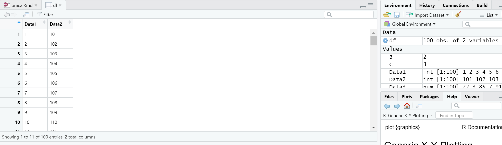

--- 
title: "CASA0005 Geographic Information Systems and Science"
author: "Andy MacLachlan and Adam Dennett"
date: "`r Sys.Date()`"
site: bookdown::bookdown_site
output: bookdown::gitbook
documentclass: book
bibliography: [book.bib, packages.bib]
biblio-style: apalike
link-citations: yes
github-repo: rstudio/bookdown-demo
description: ""
---
# Welcome

Welcome to the CASA0005 Geographic Information Systems and Science online pratical handbook. This website is hosted on Github and holds all the practical instructions and data. All data used within the practicals is aviaiable online, however occasionally websites can undergo maintenance or be inaccessible due to political facors such as the government shutdowns.  

If you need the practical data you can access it from my github repository here: https://github.com/andrewmaclachlan/CASA0005

Practical data is divided into the relevant sessions, although sometimes i'll refer to a dataset used within a previous week. 

## The world of GIS 

Spatial analysis can yield fascinating insights into geographical relationships. However, at times it can be difficult to work with. You will get lots of error messages and have software crash. The academic staff are here to help you work through these practicals but we do not know everything. It's a good idea to become familar with online sources of help, such as:

* Stack Exchange https://stackexchange.com/
* QGIS documemtation https://docs.qgis.org/3.4/en/docs/index.html
* R documentation https://www.rdocumentation.org/
* ArcGIS help pages https://support.esri.com/en

## Getting Started 

One of the issues with GIS is that many of the files we will be working with are quite large. Fortunately, in recent years, UCL has seriously beefed up the storage available for students. You now get 100GB of free storage, which should be plenty for the work you will be doing this year! The Bartlett faculty has several gigabytes of storage space available on their central servers, so before we get started, we will connect to our N drive to carry out all of our practical work over the coming weeks. 

## Offline viewing 

If you are unable to access the internet to view this github website most web browsers allow you to save webpages for offline viewieng. 

Insturctions for Google Chrome are provided here: https://support.google.com/chrome/answer/7343019?co=GENIE.Platform%3DDesktop&hl=en&oco=1


```{r include=FALSE}
# automatically create a bib database for R packages
knitr::write_bib(c(
  .packages(), 'bookdown', 'knitr', 'rmarkdown'
), 'packages.bib')
```

<!--chapter:end:index.Rmd-->


# Practical 1 – Geographic Information

## Learning outcomes

By the end of this practical you should be able to:

* Describe and explain GIS data formats and databases 
* Source and pre-process spatial data 
* Load and undertaken some basic manipulcation of spatial data in: ArcMap, QGIS and R 
* Evaluate the (dis)advantages of each GIS you have used

## The Basics of Geographic Information

Geographic data, geospatial data or geographic inforamtion is data that identifies the location of features on Earth. There are two main types of data which are used in GIS applications to represent the real world. **Vectors** that are composed of points, lines and polygons and **rasters** that are grids of cells with individual values.

*Real world* 
 *Raster* 
*Vector* 

In the above example the features in the real world (e.g. lake, forest, marsh and grassland) have been represented by points, lines and polygons (vector) or discrete grid cells (raster) of a certain size (e.g. 1 x 1m) specifying land cover type.

### Important GIS data formats

There are a number of commonly used geographic data formats that store vector and raster data that you will come across during this course and it’s important to understand what they are, how they represent data and how you can use them.

#### Shapefiles

Perhaps the most commonly used GIS data format is the shapefile. Shapefiles were developed by ESRI (http://www.esri.com/) – one of the first and now certainly the largest commercial GIS company in the world. Despite being developed by a commercial company, they are mostly an open format and can be used (read and written) by a host of GIS Software applications. 

A shapefile is actually a collection of files – at least three of which are needed for the shapefile to be displayed by GIS software. They are:

  1. ```.shp``` - the file which contains the feature geometry
  2. ```.shx``` - an index file which stores the position of the feature IDs in the  ```.shp ``` file
  3. ```.dbf``` - the file that stores all of the attribute information associated with the coordinates – this might be the name of the shape or some other information associated with the feature
  4. ```.prj``` - the file which contains all of the coordinate system information (the location of the shape on Earth's surface). Data can be displayed without a projection, but the ```.prj``` file allows software to display the data correctly where data with different projections might be being used
  
#### GeoJSON

GeoJSON (Geospatial Data Interchange format for JavaScript Object Notation, http://geojson.org/) is becoming an increasingly popular spatial data format, particularly for web-based mapping as it is based on JavaScript Object Notation. Unlike a shapefile in a GeoJSON, the attributes, boundaries and projection information are all contained in the same file.  
  
#### Shapefile and GeoJSON

We're now going to explore a shapefile (```.shp``` ) and GeoJSON (```.geojson```) in action. 

Go to: http://geojson.io/#map=16/51.5247/-0.1339

```{r echo=FALSE, out.width = "700px", fig.align='center'}
knitr::include_graphics('prac1_images/JSONwebsite.png') 
```

  1. Using the drawing tools to the right of the map window, create 3 objects: a point, line and a polygon as I have done above. Click on your polygon and colour it red and colour your point green
  2. Using the ‘Save’ option at the top of the map, save two copies of your new data – one in ```.geojson``` format and one in ```.shp``` format
  3. Open your two newly saved files in a text editor such as notepad or notepad++. For the shapefile you might have to unzip the folder then open each file individually. What do you notice about the similarities or differences between the two ways that the data are encoded?

#### Raster data

Most raster data is now provided in GeoTIFF (```.tiff```) format, which stands for Geostarionary Earth Orbit Tagged Image File. The GeoTIFF data format was created by NASA and is a standard public domain format. All necesary inforamtion to establish the location of the data on Earth's surface is embedded into the image. This includes: map projection, coordinate system, ellipsoid and datum type. 

#### Other data formats

Aforementioned data types and formats are likely to be the ones you predominately encounter. However there are several more used within spatial analysis. Theres include:

**Vector**

  * GML (Geography Markup Language – gave birth to KML) - http://www.opengeospatial.org/standards/gml 

**Raster**

  * Band SeQuential (BSQ) - technically a method for encoding data but commonly refered to as BSQ.
  * Hierarchical Data Format (HDF)
  * Arc Grid

There are normally valid reasons for storing data in one of these other formats. For example, BSQ are  raster data with a seperate text header file (```.hdr```) providing geographic spatial reference information. Earth observation data often monitors the electromagenitc spectrum in bands. Humans see in the visible range of the spectrum and our vision is composed of red, green and blue wavelengths. If we wanted to analyse just the red wavelength the BSQ format would let us *read in* only that data. In comaprsion a GeoTIFF might come with all the data 'packaged' in one file and when doing analysis over thousands of images would significantly slow things down. That said you can now often find GeoTIFFs seperated in a similar format to BSQ and it's fairly straightforward to convert between raster formats. 

#### Geodatabase

A geodatabase is a collection of geographic data held within a database. Geodatabases were developed by ESRI to overcome some of the limitations of shapefiles. They come in two main types: Personal (upto 1 TB) and File (limited to 250 - 500 MB), with Personal Geodatabases storing everything in a Microsoft Access database (```.mdb```) file and File Geodatabases offering more flexibility, storing everything as a series of folders in a file system. In the example below we can see that the FCC_Geodatabase (left hand pane) holds multiple points, lines, polygons, tables and raster layers in the contents tab.   

```{r echo=FALSE, out.width = "500px", fig.align='center'}
knitr::include_graphics('prac1_images/geodatabase.png') 
```

#### GeoPackage
```{r echo=FALSE, out.width = "100px", fig.align='center'}
knitr::include_graphics('prac1_images/geopkg.png')
```

A GeoPackage is an open, standards-based, platform-independent, portable, self-describing, compact format for transferring geospatial data. It stores spatial data layers (vector and raster) as a single file, and is based upon an SQLite database, a widely used relational database management system, permitting code based, reproducible and transparent workflows. As it stores data in a single file it is very easy to share, copy or move.  

#### SpatiaLite
```{r echo=FALSE, out.width = "100px", fig.align='center'}

```

SpatialLite is an open-source library that extends SQLite core. Support is fairly limited and most software that supports SpatiaLite also supports GeoPackage, as they both build upon SQLite. It doesn't have any clear advantage over GeoPackage, however it is unable to support raster data. 

#### PostGIS
```{r echo=FALSE, out.width = "100px", fig.align='center'}
knitr::include_graphics('prac1_images/postGIS.jpg') 
```

PostGIS is an opensource database extender for PostrgeSQL. Essentially PostgreSQL is a database and PostGIS is an add on which permits spatial functions. The advantages of using PostGIS over a GeoPackage are that it allows users to access the data at the same time, can handle large data more efficiently and reduces processing time. In this example (https://medium.com/@GispoLearning/learn-spatial-sql-and-master-geopackage-with-qgis-3-16b1e17f0291) calcualting the number of bars per neighbourhood in Leon, Mexico the processing time reduced from 1.443 seconds (SQLite) to 0.08 seconds in PostGIS. However, data stored in PostGIS is  much harder to share, move or copy.

#### What will I use

The variety of data formats can see a bit overwhelming. But don't worry, most of the time you'll be using shapefiles, GeoPackages or raster data.

## Data 

The volume of geographic information which is freely available for use in the UK is increasing exponentially and spatially referenced data can often be found in many different places. In this practical we're going to use data from the London data store ---  a free and open data-sharing portal provided by the Greater London Authrotiy (GLA), also known as City Hall that is the devovled regional governance body of London. 

We are going to get spatial data of the London boroughs and join flytipping (the illegal deposit of waste, commonly on road verges) data that is provided as a ```.csv``` file. ```.csv``` stands for comma-separated values (CSV)  ---  it uses a comma to separate each value. 

At the end of this document I'll also run through some common sources of data that will stand you in good stead (be advantagous) for the rest of the course. 

### File paths

In your N drive: create a new folder called GIS and within this a subfolder called wk1. It is up to you how you organise your files. Make sure you change the file paths within where appropraite to your own.

### Data download

Firstly we need to get a spatial outline of the London boroughs. The geographic boundaries that are used in the UK are a complex, often inter-related, but ever changing mass of areas. For anyone new to the UK (or indeed not a trained quantitative geographer), it can be quite a daunting task to attempt to understand all of the boundaries that are in use. Fortunately the Office for National Statistics (ONS) has an online beginners guide to UK geography. If you need more information on the vast array of different UK geographies, this is the place to start: http://geoportal.statistics.gov.uk/datasets/a-beginners-guide-to-uk-geography-2018-v1-0  

* Spatial Data

1. To get the data go to: https://data.london.gov.uk/

2. Seach for Statistical GIS Boundary Files for London

3. Download the statistical-gis-boundaries-london.zip

4. Unzip the data and save it to your wk1 folder.

* CSV data

1. On the same website search for fly-tipping incidents

2. Download the ```.csv``` file

### Data pre-processing

**Question** Open the ```.csv``` in Excel, what do you notice about how the data is stored?

**Answer** The year is a column and for each area the values are repeated for different years. In our analysis it is easier to have the different years as a coloumn and populated for each area. So, we want to go from this...

```{r echo=FALSE, out.width = "600px", fig.align='center'}

```

To this...

```{r echo=FALSE, out.width = "600px", fig.align='center'}
knitr::include_graphics('prac1_images/csv_pivot.png')
```

As we are going to use this dataset in ArcMap, QGIS and R I've done it in Excel using a pivot table.

1. Go to Insert > PivotTable

2. Select the original table and create a PivotTable in a new worksheet

3. The PivotTable Field box will appear, experiment with the different fields in each of the areas

I've used the following:

```{r echo=FALSE, out.width = "200px", fig.align='center'}

```
Note how I've altered the total_action_taken to the sum of... as the original was displaying incorrectly, to do so:

1. Click on drop down button for total_action_taken > Value Field Settings > select Count  

It's important to think about what data we actually need in the next step and it's good practice to avoid data redundancy where possible.

**Spoiler** The spatial data we have downloaded already contains borough name, so we don't need it twice. However, we do need a field to link the two datasets on. You could use borough name, but when using text fields sometimes input variations can affect joins. For example, you had the University of Manchester in one dataset and Manchester University in another the join would fail. Consequntly it's usually best to join datsets on a code field. 

Now save the Excel sheet that contains the pivot table as a new ```.csv```. Make sure that the first row of data holds the coloumn titles. Remove all empty rows.

When saving the file also avoid any special characters (e.g. -) and spaces, use an underscore instead of spaces. 

**Warning** Spatial software (especially ArcGIS) does not like file names with spaces or special characters.

### Data loading

Now it's time to load, inspect and do some basic manipulation of this data. As mentioned in the lecture there are several GIS software 'types', here we will repeat the same process across ArcGIS, QGIS and R. Each system has specific benefits, but in general there has been a recent shift towards the use of QGIS and R, both being opensource. ArcGIS was the first major spatial analysis software produced by the Environmental Systems Research Institute, Inc. (Esri), founded in 1969 by Jack Dangermond. Due to its high cost and lack of customisation it is now less commonly used within the research community. 

```{r echo=FALSE, out.width = "300px", fig.align='center'}

```

### ArcGIS

#### Basics

ArcGIS should be installed as a standard programme in the UCL desktop and you can navigate to it from the Windows start button. 

##### Installing ArcGIS on your own computer
As a UCL student, you can install ArcGIS on your own computer. This is easy if you have a PC, but if you have a Mac this can be trickier as Arc will only run in a PC environment. If you have a Mac, the options open to you are either to:

a)	Run ArcGIS through the Desktop@UCL application - http://www.ucl.ac.uk/isd/services/computers/remote-access/desktop 
b)	Duel boot your machine using bootcamp, install Windows (7 or 8 is fine) and then install Arc onto the Windows partition. 
c)	Install some kind of virtualisation software such as Parallels (http://www.parallels.com/ca/products/desktop/) or VMware (http://www.vmware.com/products/fusion/), and run Arc on a virtual windows machine

If you can, it is preferable to run Arc on Bootcamp as virtualisation software can be slow, but the Desktop@UCL facility should suffice for this course.
ArcGIS (Version 10.6 is the latest at time of writing, but may have already been superseded) can be downloaded from the UCL Software Database for free --- https://swdb.ucl.ac.uk/.  

##### Getting Help

ArcGIS is a huge and complex piece of software, but thankfully is has an excellent help system – depending on the version you are using (they are all quite similar anyway) you can access the online help system here:

* http://resources.arcgis.com/en/help/main/10.2/

* http://resources.arcgis.com/en/help/main/10.1/

##### ArcGIS

ArcGIS is actually a whole suite of software built and maintained by ESRI (http://www.esri.com/software/arcgis).Within the ArcGIS for Desktop suite you will find the following programmes:

* **ArcCatalog --- Similar to Windows Explorer, ArcCatalog allows you to manage your GIS files, folders and geodatabases**

* ArcGIS Administrator --- This programme us used to manage licences for the various elements of ArcGIS
 
* ArcGlobe --- ArcGlobe allows you to view and analyse your data in 3D –-- this interface looks very similar to Google Earth and is part of the 3D analyst extension

* **ArcMap --- This is the programme you will use most often –-- it is the main mapping and spatial analysis element of ArcGIS**

* ArcScene --- ArcScene is a 3D viewer which allows you to navigate and interact with your 3D raster and feature data

ArcCatalog and ArcMap are in bold as these are the only programmes we will be using explicitly in this course. By all means experiment with the others if you have any spare time! 

#### ArcCatalog

* Find and run the ArcCatalog piece of software

* Once ArcCatalog Opens, go to File > Connect To Folder… and navigate to the N:\GIS folder, right click in the contents area and create a new Flie Geodatabase.

```{r echo=FALSE, out.width = "500px", fig.align='center'}
knitr::include_graphics('prac1_images/file_geo.png')
```

You can import data layers into a Geodatabase within ArCatalog, however we will do this in ArcMap.

Close ArcCatalog and never have both ArcCatalog and another ArcGIS product open at the same time.

#### ArcMap

##### Introduction

ArcMap is the core of the ArcGIS suite and where you would normally produce maps, carry out spatial analysis functions and automate processes. 

1. Search for and open ArcMap 
2. Upon opening select the database you just created in the dialogue box
3. Click ok

```{r echo=FALSE, out.width = "800px", fig.align='center'}
knitr::include_graphics('prac1_images/default_database.png')
```

When the map document opens you should see something similar to the image below, highlighting some of the key buttons:

```{r echo=FALSE, out.width = "500px", fig.align='center'}
knitr::include_graphics('prac1_images/arcmap.png')
```

4. It's important to now set the map document up properly. Go File > Map Document Properties, enter the details you wish. You can see the connection to the Geodatabase we just made. Click store relative pathnames, this means as long as the data stays in the same position relative to the path then ArcMap can load all the layers. For example if you moved your work from the C: drive to an external drive, H:.

##### Load data

5. Using the **Plus** icon (add data layer) navigate to the extracted folder you saved earlier. 
6. Open London_Borough_Excluding_MHW.shp, but feel free to explore the other data layers. In the left hand Table Of Contents you can unselect layers to turn them off or drag layers above or below to change the display order. In the example below the wards layer is showing above the borough layer.

```{r echo=FALSE, out.width = "800px", fig.align='center'}

```

**Note**, while we have loaded the shapefile, it is not stored in our Geodatabase yet.

**Useful tips**
  
  * To the right of the document you will see the Catalog and Search tabs.The Catalog tab is a more compact version of ArcCatalog and will let you see what data is stored in the current Geodatabase. The search tab will let you find any analysis tool within ArcGIS. Try searching for Clip.
  
  * If you right click on the boroughs layer (in the Table of Contents, left hand pane) you will see various options. Zoom to layer is very useful if you ever get lost in your ArcMap document. 

7. Now right click on the borough layer (in the Table of Contents) and open the attribute table. You'll see the GSS_CODE field, which is the same code we output in our ```.csv```. If you now right click on a field you'll also be able to see the data type (e.g. string, integer). For example:

```{r echo=FALSE, out.width = "500px", fig.align='center'}

```

##### Join data

We're now going to join our flytipping data to the lonon borough shapefile. So:

8. Right click on the london borough layer > Joins and Relates > Join   
9. Select the GSS_CODE as the field in the layer to base the join on
10. Navigate to the ```.csv``` we created earlier
11. Select the code field that matches (in my case this is called Row Labels)
12. Select only to join matching records
13. Validate join and click OK

**You will get errors**, ArcMap does not like fields starting with numbers (e.g. 2012), dashes (e.g. -) or spaces. Feel free to change them in the original ```.csv``` but for this practical it is fine to continue. 

14. The join should work, so reopen the attribute table for the layer London boroughs

**Note**, the join we have made is not permanent. To do so we need to export the layer.

##### Export data

15. Right click on the london boroughs layer > Data > Export Data 
16. The location should default to our GeoDatabase. Be sure to change the filename --- again avoid all of the characters (e.g. spaces and -) previously mentioned. Add the data layer to the map  

Now lets use the data we've joined to create a basic thematic map. 

17. Right click on the new London borough layer > Properties
18. Under the Symbology tab select Graduated colors 
19. Select the Value as one of the years of data we joined and change the classificaiton to something of your choice

```{r echo=FALSE, out.width = "800px", fig.align='center'}

```

You should have something that looks like this:

```{r echo=FALSE, out.width = "800px", fig.align='center'}

```

**We haven't talked about the Coordiante Reference System (CRS) (or Spatial Reference System (SRS)) of our map document**

A coordinate reference system is a series of paramters that define the coordinate system. Within GIS we use geographic or projected cooridnate systems. The former uses a three-dimesional spherical surface to define locations of Earth, whereas the latter is defined on a flat, two-dimesional surface giving it constat lengths, angles and areas. 

In ArcMap we can specify what CRS we want to use by: 

20. Right clicking on the map document > Data Frame Properties

You'll see that it is already set to Projected Coordinate Systems, National Grids, Europe, British National Grid. This is because ArcMap will default to the cooridnate system of the first data layer loaded.  

```{r echo=FALSE, out.width = "300px", fig.align='center'}
knitr::include_graphics('prac1_images/coorindate_system.png') 
```

Save and then close your ArcMap document. We're now going to replicate this task in QGIS.

***Note*** As we are going to open the same files in difference GIS systems it is important to close the software before moving on. If you don't then files can be *locked* and unreadable as they are still considered to be in use.

### QGIS

#### Introduction

QGIS is very similar to ArcMap except that as it is open-source and free there are many add on packages that (or plugins) that provide additional functionality to the software.  

To get QGIS on your personal machine go to: https://qgis.org/en/site/forusers/download.html

I install the OSGeo4W version. The nature of open-source means that several programs will rely on each other for features. OSGeo4W tracks all the shared requirements and does not intall any duplicates. 

#### Load data

1. Search for and open QGIS 
2. Click on the open data source manager. Just above the word *browser* in the top left of the screen

```{r echo=FALSE, out.width = "700px", fig.align='center'}
knitr::include_graphics('prac1_images/qgis_datamanager.png') 
```

3. Navigate to the London boroughs layer ```.shp``` and add it, you then have to close the data source manager

Just like in ArcMap you can right click on the layer to view the attribute table. Unlike ArcMap you have to load the ```.csv``` file into QGIS in order to join it to a shapefile.

4. Open the data source manager and select Delimited Text
5. Navigate to our ```.csv``` file and provide a suitable layer name
6. Under Record and Fields Options make sure the number of header lines to discard is 0 and the First record has field names box is selected (this is assuming you left a title for each coloumn in your ```.csv```)
7. Under Geometry Definition select No geometry (attribute table only)

```{r echo=FALSE, out.width = "700px", fig.align='center'}
 
```

Does the sample data seem right?

8. If so, click add then close

#### Join data

9. Right click on the London boroughs layer > Properties > Joins
10. Click the plus button at the bottom of the box
11. Complete the dialouge box

```{r echo=FALSE, out.width = "500px", fig.align='center'}
knitr::include_graphics('prac1_images/qgis_join.png') 
```

#### Export data 

Now instead of using a GeoDatabase, let's export to a GeoPackage.

12. Right click on the London boroughs layer > Export > Save Feautre As
13. Select the GeoPackage format and complete the File name (the saved file name for the GeoPackage) and the Layer name (the name for this layer within the GeoPackage). Recall that a GeoPackage can store many data layers as a single file
14. The new layer will be added to the map, so you can remove the old one. Make sure you remove the right one

```{r echo=FALSE, out.width = "500px", fig.align='center'}
knitr::include_graphics('prac1_images/make_geopkg.png') 
```

We've now made a GeoPackage that we can connect our map project to.

15. Under *Browser*, Right click on GeoPackage > New Connection > Navigate to your GeoPackage
16. Click the down arrow left to GeoPackage and you should see the one you just navigated to. Click the down arrow on the database and you can see your layer.
17. Now we are going to import our  ```.csv ``` into our GeoPackage. To do so go: Database > DB Manager
18. Select your GeoPackage in the left hand pane
19. Import layer/file then select the  ```.csv ```. Click Ok.

Again, remember that the ```.csv ``` in the Layers tab (bottom left) is the original. Remove it, then from the GeoPackage just click, hold and drag the  ```.csv ``` into the layer pane.

Now let's make a quick thematic map like we did in ArcMap.

20. Right click on your London boroughs layer > Properties > Symbology
21. Select categorised and choose a data coloumn and color ramp

You could also select graduated, however our joined data fields are in the wrong data type. If you wish to change them follow this guide: https://wiki.tuflow.com/index.php?title=QGIS_Change_Attribute_Type

22. Save your QGIS project

You should have produced something like this:

```{r echo=FALSE, out.width = "800px", fig.align='center'}
 
```

**Spatial reference**

QGIS is similar but different to ArcMap. QGIS defaults to the Coordiante Reference System (CRS) WGS 84, or known by its European Petroleum Survey Group (EPSG) code 4326. However, when you add your first layer in will default to that CRS. We'll go into the background of EPSG next time.

You can change the CRS by going File > Properties and selecting CRS in the left hand pane.

### R

#### Introduction

R is both a programming language and software environment, originally designed for statistical computing and graphics. R’s great strength is that it is open-source, can be used on any computer operating system and free for anyone to use and contribute to. Because of this, it is rapidly becoming the statistical language of choice for many academics and has a huge user community with people constantly contributing new packages to carry out all manner of statistical, graphical and importantly for us, geographical tasks.

The purpose of this practical is just to demostrate data loading and manipulation in different software. The next practical will provide much more detail on R, so don't worry.

Search for and open R Studio.

You can install R Studio on your own machine from: https://www.rstudio.com/products/rstudio/download/#download

R studio requires R which you can download from: https://cran.rstudio.com/

RStudio is a free and open-source integrated development envrionment for R --- it makes R much easier to use.

In RStduio go:

1. File > New File > R Script

You should be able to see these quadrants: 

```{r echo=FALSE, out.width = "800px", fig.align='center'}
knitr::include_graphics('prac1_images/RStudio.png') 
```

Below are bits of code, to start we will work using the **console**. So just copy the bits of code into the console window, changing the file names to where your data is stored. Then at the end of this section I'll show you how to make a script.

R works on packages that are collections of functions and data. For this practical we will need the ones listed in the code chunk below. Whilst we've installed them, we haven't yet loaded them. It's best practice to do all this at the start of your code, however, for demonstration purpoposes I'll load each one as we need it. 

```{r, message=FALSE, warning=FALSE, eval=FALSE}
install.packages("sf", "tmap", "tmaptools", "RSQLite", repos = "https://www.stats.bris.ac.uk/R/")
```

Packages we've installed:

* sf: simple features, standad way to encode spatial vector data
* tmap: layer-based and easy approach to make thematic maps
* tmaptools: set of tools for reading and processing spatial data
* RSQLite: embeds the SQLite database engine in R

Here, repos stands for repository where we will download the packages from. 

#### Load data

Great, load the sf package so we can read our shapefile in --- remember to change to filepath to your shapefile.

***Note*** by default in R, the file path should be defined with / but on a #windows file system it is defined with \. Using \\ instead allows R #to read the path correctly – alternatively, just use /

```{r, message=FALSE, warning=FALSE}
library(sf)
shape <- st_read("Prac1_data/statistical-gis-boundaries-london/ESRI/London_Borough_Excluding_MHW.shp")
```

To get a summary of the data held within the shapefile data (attribute table) enter the following:

```{r}
summary(shape)
```

To have a quick look what the shapefile looks like enter the following:
```{r}
plot(shape)
```

From what we did in QGIS and ArcMap this should look familiar. 

We now need to load our ```.csv``` file:

```{r}
mycsv <-  read.csv("Prac1_data/fly_tipping_borough_edit.csv")  
```

To view the data just input:

```{r}
mycsv 
```

#### Join data

In R we've given our London boroughs shapefile the name shape and our flytipping ```.csv``` the name mycsv. If you look in the Environment quadrant you should see them both listed. 

Join the ```.csv``` to the shapefile. Here, replace Row.Labels with whatever your GSS_CODE is called in the ```.csv```:


```{r}
library(tmap)
library(tmaptools)
shape <- append_data(shape, mycsv, key.shp="GSS_CODE", key.data = "Row.Labels")
```

Let's break this down a bit. We just created a data frame (my.csv) where each coloumn has a variable and each row contains a set of values --- so basically a normal table. The match simply found the GSS_CODE values in the ```.csv``` and joined the data to our shapefile.

The message detailing 1 out of the 34 data records were not appended refers to the Grand Total row within the ```.csv```. 

Check the merge was successful, this is just going to show the top 10 rows:

```{r}
head(shape, n=10)
```

Now, let's make a quick thematic map (or a qtm) using the package  ```tmap ```. I've made mine for flytipping between 2011 and 2012 (coloumn X2011_12): 

```{r}
library(tmap)
library(tmaptools)
tmap_mode("plot")
qtm(shape, fill = "X2011_12")
```

### Export data

Finally write shape to a new GeoPackage (```.gpkg```) giving it the layer name of your choice:

```{r}
st_write(shape, "Prac1_data/Rwk1.gpkg", "london_boroughs_fly_tippint", delete_layer=TRUE)
```

So here, we are saying the shape is the object we want to save, then to the GeoPackage file path, with the layer name of london_boroughs_fly_tippint. I've set delete_layer to true so I could overwrite mine when I developed this practical. Changing it to false would generate an error message if you ever tried to re-run the code.

Let's also add the ```.csv``` as we did in QGIS. This is a bit more complicated as we have to use the SQLite datavase package. Firstly, connect to the ```.gpkg``` we just made:

```{r}
library(RSQLite)
con = dbConnect(SQLite(),dbname="Prac1_data/Rwk1.gpkg")

```

Now examine what is in the ```.gpkg```:
```{r}
dbListTables(con)
```

Then add add our ```.csv``` and disconnect from the ```.gpkg```:

```{r}
dbWriteTable(con,"original_csv", mycsv, overwrite=TRUE)
dbDisconnect(con)
```

#### Making a script

To convert this bit of analysis into a script that we could save and run again in future, I would write the following in the script quadrant: 

```{r, eval=FALSE}
install.packages("sf", "tmap", "tmaptools", "RSQLite", repos = "https://www.stats.bris.ac.uk/R/")
library(sf, tmap, tmaptools, RSQLite)
shape <- st_read("Prac1_data/statistical-gis-boundaries-london/ESRI/London_Borough_Excluding_MHW.shp")
mycsv = read.csv("Prac1_data/fly_tipping_borough_edit.csv")  
shape<-append_data(shape, mycsv, key.shp="GSS_CODE", key.data = "Row.Labels")
tmap_mode("plot")
qtm(shape, fill = "X2011_12")
st_write(shape, "Prac1_data/Rwk1.gpkg", "london_boroughs_fly_tippint", delete_layer=TRUE)
con = dbConnect(SQLite(),dbname="Prac1_data/Rwk1.gpkg")
dbListTables(con)
dbWriteTable(con,"original_csv", mycsv, overwrite=TRUE)
dbDisconnect(con)
```
You can then save your script through File > Save As.

### What will I use

Well... it depends. If you wanted to quickly open a dataset to explore its contents then i'd use QGIS or ArcMap. However, if you had 100 raster images that you wanted to clip to your study area, i'd automate it in R. There are also specfic packages developed for each type of software that might dictate what you use, for example I recently made use of the Urban Multi-sacle Envrionmental Predictor (UMEP) plugin in QGIS. That said, as I needed to match different hourly meterological varaibles over a three year period I automated the first part of the analysis in R and loaded a ```.csv``` into QGIS.  

## Data sources and task

Below i've listed a few good data sources. **For this week's task** explore these and any others you can find and get an interesting dataset (e.g. in this practical our flytipping ```.csv```) that you could join to some spatial data (e.g. in this practical the London boroughs ```.shp```). This could be for any location in the world. 

### UK Data Service

The UK Data Service geography service (https://census.edina.ac.uk/) has a library of hundreds of current and former boundary datasets for which attribute data are produced in the UK.

### ONS 

The Office for National Statistics (ONS) are the national statistical agency for England and Wales and have recently started to provide access to boundary data for the statistics they produce for various geographic areas. 

Many of the boundaries on the ONS Geoportal are also available from the Edina Census Geography website in a more flexible fashion, however the ONS website provides very quick access to bulk-downloads –-- something which can be very useful when reading data directly from the web using computer software. 

### OS 

The Ordnance Survey (OS) are the national mapping agency for the UK. A few years ago, they opened up a number of their data products for public use including greenspace, OS Open Map and OS Terrain.

For the full range see: https://www.ordnancesurvey.co.uk/business-and-government/products/finder.html?Licensed%20for=OpenData%20(Free)&withdrawn=on  

### Edina Digimap

Before the Ordnance Survey opened up much of its data for public use, academics and students in the UK could access OS data using the Edina Digimap Service --– this service is still available today and provides access to a number of products in addition to those available from OS Open Data. 

Perhaps the most exciting of the additional OS data products available from Digimap is OS MasterMap. MasterMap is a framework for all OS data and contains layers of data that include details of real world objects such as buildings, roads, paths, rivers, physical structures and land parcels, as well as the complete UK transport network. Whilst we still are required to go through Edina OS have recently annonced plans to make this dataset free in the near future under the new Geospatial Commission. 

```{r echo=FALSE, out.width = "500px", fig.align='center'}
knitr::include_graphics('prac1_images/mastermap.png') 
```

### OSM

Open Street Map (OSM) is a fantastic resource --– as the name suggests, all data contained in Open Street Map are open and free for anyone to use. Much like Wikipedia, anyone can contribute content to OSM and this brings with it its own benefits (frequent updates, very large user-base) and problems (data quality and patch coverage). OSM is a very good example of Volunteered Geographic Information (VGI). 

It’s possible to download OSM data straight from the website, although the interface can be a little unreliable (it works better for small areas). There are, however, a number of websites that allow OSM data to be downloaded more easily and are directly linked to from the ‘Export’ option in OSM. Geofabrik (https://www.geofabrik.de/data/download.html) allows you to download frequently updated Shapefiles for various global subdivisions. 

### DEFRA

The Department for Environmen and Rural Affairs (DEFRA) have recently created the Data Services Platform to openly distribute envrionmental data. See: https://environment.data.gov.uk/

### Data lists

Another good place to start searching for data are data lists. They simply provide a comprehensive overview of all available data conveniently categorised by discipline and country. 

I normally use this one: https://freegisdata.rtwilson.com/

## Summary

Within this practical we have explored the different types, formats and software used to store, analyse and manipulate spatial data. In relfecting upon this practical you should consider the (dis)advtanges of each, where and when they might be approraite and the overall practicality. Next week we will delve further into R and RStudio.  


<!--chapter:end:01-prac1.Rmd-->

# Practical 2 – Introduction to R

## Learning outcomes

* Examine and clean data
* More advaned data mamipulation 
* Plot graps and maps
* Create interative maps

## Introduction 

This practical is **LONG** but it will take you from not knowing much about R to making freaking cool interactive maps in one practial. As you can imagine, this will be a steep learning curve.

I will give you all the code you need, it’s your job to read through the text very carefully and try to understand what bits of code are doing as you go.

There will be bits of code you don’t fully understand. Don’t worry, the key is to revisit later and try to work out what is going on then. Learning R is a long and iterative process and this is just the start…

If you want to learn more about R and indeed download the latest version for your own use, then visit the R project pages: http://www.r-project.org/

The Wikipedia page for those who want to know a little of the history of R can be found here: http://en.wikipedia.org/wiki/R_(programming_language)

There is an almost endless supply of good R tutorials on the web. If you get stuck or want to learn even more R (and why would you not want to?!), I’d recommend trying some of the following R Tutorial websites:

* http://www.statmethods.net/index.html

* http://www.r-tutor.com/

* http://www.cyclismo.org/tutorial/R/index.html

* http://www.cookbook-r.com/

If you want to really be up to date with the state of the art in R, then https://bookdown.org/ is a fantastic resource. It features free books by some of the pre-eminent names in the R scene - I would urge you to go and take a look.

### Online forums are your friend!!

With almost every problem you encounter with R, someone else will have had the same problem before you and posted it on a forum – someone will then post a solution below.

My usual route is to google the problem and I’ll then be directed to a post, usually on StackOverflow, StackExchange or CrossValidated. When doing so try to think about the minimal working (or not working) example (MWE), by this i mean remove anything very specific to your problem. I’ve rarely not found a solution to a problem this way. 

### Health warning

Beware of posting questions on these forums yourself – contributors to these forums (especially the R ones!), whilst almost always extremely knowledgeable about R, have a bit of a reputation for being insert familiar pejorative term for less-than-polite-human-being here! As you might expect, people who have enough time to become total experts in R, have little time to work on their social skills!! Fortunately though, some other poor chump has usually taken that hit for you and you can still find a useful answer to your problem.

If you are specifically more interested in the spatial side of R, then Alex Singleton and Chris Brunsdon at the Universities of Liverpool and Maynooth also have a number of very useful R Spatial Tutorials – http://rpubs.com/alexsingleton/ & http://rpubs.com/chrisbrunsdon/

Robin Lovelace in Leeds is also frequently at the bleeding edge of developments in R spatial stuff, so keep an eye on his website too: http://robinlovelace.net/. Robin is also in the process of completing a book on GeoComputation in R, which you should definitely read! - https://geocompr.robinlovelace.net/

These websites are also very very good: https://pakillo.github.io/R-GIS-tutorial/ and http://www.maths.lancs.ac.uk/~rowlings/Teaching/UseR2012/cheatsheet.html

### R and RStudio

When you download and install R, you get the R Graphical User Interface (GUI) as standard (below). This is fine and some purists prefer using the clean, unfussy command-line original, but it has some limitations such as no graphical way to view data tables or keep track of what is in your working directory (there are a number of others too).

```{r echo=FALSE, out.width = "500px", fig.align='center'}
knitr::include_graphics('prac2_images/R.png') 
```

Fortunately there are a number of software environments that have been developed for R to make it a little more user-friendly; the best of these by a long way is RStudio. RStudio can be downloaded for free from https://www.rstudio.com/. We covered the RStudio layout last week.

### Getting started

If you are some kind of masochist, you are welcome to use the bundled R GUI for all of your work. If pain is not your thing, then for this practical (and future practicals) I will assume that you are using RStudio.

1. From the start menu on your computer, find and run R Studio

Once RStudio has opened, the first thing we will do is create a new project – projects enable you to organise your work effectively and store all of the files you create and work with for a particular task. 
2. To create a new project (and this will vary a little depending on the version of RStudio you are using), either select File > New Project… or Project > Create Project

```{r echo=FALSE, out.width = "500px", fig.align='center'}
knitr::include_graphics('prac2_images/r_newproject.png') 
```

3. Select Start a project in a brand new working directory and create a new project in a directory of a new ‘wk2’ directory on your N: drive:

```{r echo=FALSE, out.width = "500px", fig.align='center'}
knitr::include_graphics('prac2_images/new_proj.png') 
```

My file directory (the second box here) will be different to yours as this is my teaching resources folder. Keep yours simple N:/GIS/wk2.

RStudio should now open with three windows – the main R console on the left, with windows for your environment and files on the right.

### Basics 

1. R has a very steep learning curve, but hopefully it won’t take long to get your head around the basics. For example, at its most simple R can be used as a calculator. In the console window (bottom left), just type the following and press enter:

```{r}
1+5
```

or 

```{r}
4*5^2
```

As you can see R performs these calculations instantly and prints the results in the console. This is useful for quick calculations but less useful for writing scripts requiring multiple operations or saving these for future use.

2. To save your scripts, you should create a new R Script file. Do this now: Select File > New File > R Script.

3. The R Script should open up on the top-left of your GUI. **From now on type everything in this R script file and save it**

### Scripts and some basic commands

4. Usually one of the first things to do when starting a new R Script is to check that you are in the correct working directory. This is important especially if you are working on multiple projects in different locations. To do this type the following into your new empty R Script:

```{r}
getwd()
```

5. To run this line, hold Ctrl (Cmd on a Mac) and press the Return(↲) key (if you are in the standard R installation, you would run your script with Ctrl R). You should now see your current working directory appear in the console.

6. Because of the new project we have already set up, this working directory should be correct, but if for any reason we wanted to change the working directory, we would use the setwd() function. For example, we wanted to change our directory to the documents folder on the C drive, we could run (don’t do this now):

```{r eval=FALSE}
setwd("C:/Documents")
```

7. When we are sure we are working in the correct working directory, we can save our script by clicking on the save icon on the script tab. Save your script as something like “wk2_part1” and you will see it appear in your files window on the right hand side. As you build up a document of R code, you should get into the habit of saving your script periodically in case of an unexpected software crash.

8. We can now begin to write a script without the need to run each line every time we press enter. In the script editor type:

```{r}
A <- 1
B <- 2
C <- A+B
C
```

9. Select (highlight) the three lines and run all three lines with Ctrl Return(↲). You will notice the lines appear in the console (the other window). If you type C and press enter in the console (C and then ctrl return in the script window) you should have the number 3 appear. From now on I recommend you type all the commands below in the script first and then run them. Copying and pasting from this document won’t necessarily work.

10. You will also notice that in RStudio, values A, B and C will appear in your workspace window (top right). These variables are stored in memory for future use. Try giving A and B different values and see what happens. What about if you use lower case letters?

11. You have just demonstrated one of the powerful aspects of R, which is that it is an **object oriented** programming language. A, B and C are all objects that have been assigned a value with the <- symbol (you can also use the = sign, but it operates slightly differently to <- in R, plus the arrow assignment has become standard over the years. Use **alt -** to type it automatically). This principle underlies the whole language and enables users to create ever more complex objects as they progress through their analysis. If you type:

```{r}
ls()
```
R will produce a list of objects that are currently active.

```{r}
rm(A)
```

will remove the object A from the workspace (do ls() again to check this or look in your workspace window).

### Functions

12. Both rm() and ls() are known as functions. Functions are the other fundamental aspect to the R language. Functions can be thought of as single or multiple calculations that you apply to objects. They generally take the form of:

```{r, eval=FALSE}
function(object, parameter1, parameter2, parameter3...)
```

13. You can write your own functions to carry out tasks (and we’ll come onto that in subsequent practical sessions), but normally you will just used one of the virtually infinite number of functions that other people have already written for us.

### Basic plotting

For example, one common function is the ```plot()``` function for displaying data as a graphical output. Add these lines to your script and run them as before and you can see some ```plot()``` outputs:
```{r}
#create some datasets, first a vector of 1-100 and 101-200
Data1 <- c(1:100)
Data2 <- c(101:200)
#Plot the data
plot(Data1, Data2, col="red")
```

```{r}
#just for fun, create some more, this time some normally distributed
#vectors of 100 numbers
Data3 <- rnorm(100, mean = 53, sd=34)
Data4 <- rnorm(100, mean = 64, sd=14)
#plot
plot(Data3, Data4, col="blue")
```

14. In the code above, you will have noticed the # symbol. This signifies that whatever comes after it on that line is a comment. Comments are ignored by the R console and they allow you to annotate your code so that you know what it is doing. It is good programming practice to comment your code extensively so that you can keep track of what your scripts are for.

### Help

15. The previous lines of code also demonstrated a number of functions: c() concatenates a string of numbers together into a vector. 1:100 means produce the integers between and including 1:100, the plot() function plots the two data objects and includes a parameter to change the colour of the points. To understand what a function does, you can consult the R Help system. Simply type a question mark and then the function name; for example:

```{r eval=FALSE}
?plot
```

```{r echo=FALSE, out.width = "300px", fig.align='center'}
knitr::include_graphics('prac2_images/rhelp.png') 
```

16. In RStudio you will see the help file appear in the Help window in the bottom right of the GUI. Here you can also search for the help files for other functions in the search bar.

### Data types

17. Objects in R can exist as a number of different data types. These include a **matrix**, a **vector**, a **data frame** and a **list**. For the purposes of this practical we will focus on data frames. These are the most flexible data format in R (although tibbles are now becoming popular as well). Data frames can be conceptualised in a similar way to a spreadsheet with data held in rows and columns. They are the most commonly used object type in R and the most straightforward to create from the two vector objects we just created.

```{r}
df <- data.frame(Data1, Data2)
plot(df, col="green")
```

18. If you have a very large data frame (thousands or millions of rows) it is useful to see only a selection of these. There are several ways of doing this:

```{r}
#show the first 10 and then last 10 rows of data in df...
head(df)
```

```{r}
tail(df)
```
You can also view elements of your data frame in RStudio by simply clicking on it in the top-right Environment window:

```{r echo=FALSE, out.width = "800px", fig.align='center'}
 
```

### Elements of a data frame

19. When programming you will frequently want to refer to different elements in a data frame or a vector/list. To select elements of a data frame, or subset it, you can refer specifically to ranges or elements of rows and columns. These are accessed using the single square bracket operator [], with the form:

```{r eval=FALSE}
data.frame[row,column]
```

Rows are always referenced first, before the comma, columns second, after the comma.

20. Try the subsetting your df data frame with the following commands to see what is returned:

```{r}
df[1:10, 1]
df[5:15,]
df[c(2,3,6),2]
df[,1]
```

21. You will note that the column headings are the names of the original objects creating the data frame. We can change these using the ```colnames()``` function:

```{r}
colnames(df)<- c("column1", "column2")
```

To select or refer to these columns directly by name, we can either use the ```$``` operator, which takes the form  ```data.frame$columnName```, e.g.

```{r}
df$column1
```

or we can use the double square bracket operator [[]], and refer to our column by name using quotes e.g.

```{r}
df[["column1"]]
```

This again is useful if you have a lot of columns and you wish to efficiently extract one of them.

## Reading data into R

One of the most tedious things a spatial analyst / data scientist has to do is clean their data so it doesn’t cause problems for the software later. In the past, we would have needed to do this by hand - these days, we can use software to do much of this for us.

I will now give you two options to arrive at a nice cleaned dataset. If you have issues with software packages etc, you might still need to via the old skool route, however, the new skool route will be much more satisfying if it works!

For this example we are going to use the London Datastore Catalogue.

Go to: https://data.london.gov.uk/dataset/london-datastore-catalogue and download the excel document.

### Old skool cleaning

22. Open the ```LondonData.xls``` file in Excel, and save as ```LondonData.csv``` into your wk2/RProject folder.

23. Open your new ```.csv``` file in Excel. There might be some non-numeric values inside numeric columns which will cause problems in your analysis. These need to be removed before proceeding any further. To remove these, you can use the replace function in Excel. In the home tab under ‘Editing’ open up the find and replace dialogue box and enter the following into the find box:

```#VALUE!``` ```#n/a```

Leave the replace box empty each time and click Replace All to remove these from your file, before saving the file again.

24. Once you have cleaned out all of the trixy characters from the file, to read it into R, we will use the read.csv() function:

```{r}
LondonDataOSK<- read.csv("prac2_data/london_catalogue.csv")
```

*Note*, i've made an R project for all these practicals, which is why my file path starts with ```prac2_data/```. If you save the ```.csv``` in the same folder as the ```.Rproj``` then you can just use:

```{r eval=FALSE}
LondonDataOSK<- read.csv("LondonData.csv")
```

If you look at the ```read.csv()``` help file - ```?read.csv``` - you will see that we can actually include many more parameters when reading in a .csv file. For example, we could read in the same file as follows:

```{r}
# by default in R, the file path should be defined with / but on a #windows file system it is defined with \. Using \\ instead allows R #to read the path correctly – alternatively, just use /
LondonDataOSK<- read.csv("prac2_data/london_catalogue.csv", header = TRUE, sep = ",")
```

This would specify the exact path; that the first row of the file contains header information; and the values in the file are separated with commas (not ; or : as can be the case sometimes).

### New skool cleaning 

To clean our data as we read it in, we are going to use a package (more about packages later - for now, just think about it as a lovely gift from the R gods) called readr which comes bundled as part of the tidyverse package. If you want to find out more about the Tidyverse (and you really should) then you should start here: https://www.tidyverse.org/ - the Tidyverse package contains almost everything you need to become a kick-ass data scientist. ‘Tidy’ as a concept in data science is well worth reading about and you should start here with Hadley Wickham’s paper - http://vita.had.co.nz/papers/tidy-data.pdf

Anyway, first install the package:

```{r, message=FALSE, eval=FALSE}
install.packages("tidyverse", repos = "https://www.stats.bris.ac.uk/R/")
```

Now we can use the ```readr``` package which comes bundled as part of the tidyverse to read in some data (directly from the web this time - read.csv can do this too) and clean text characters out from the numeric columns before they cause problems:

```{r, message=FALSE}
library(tidyverse)
#wang the data in straight from the web using read_csv, skipping over the 'n/a' entries as you go...
LondonData <- read_csv("https://files.datapress.com/london/dataset/ward-profiles-and-atlas/2015-09-24T14:21:24/ward-profiles-excel-version.csv", na = "n/a")
```

**note the use of read_csv here as opposed to read.csv. They are very similar, but read_csv is just a bit better - read this to understand why… Also, for those python fans out there - IT’S NOT THE SAME FUNCTION AS READ_CSV IN PYTHON**

### Examining your new data

25. Your new data has been read in as a data frame / tibble (a tibble is just a data frame with a few extra bells and whistles). If you ever need to check what data type your new data set is, we can use the ```class()``` function:

```{r}
class(LondonData)
```

```{r, eval=FALSE}
# or, if you have your old skool data from step 24 above
class(LondonDataOSK)
```

We can also use the ```class``` function within another two functions (cbind() and lapply()) to check that our data has been read in correctly and that, for example, numeric data haven’t been read in as text or other variables. Run the following line of code:

```{r}
datatypelist <- data.frame(cbind(lapply(LondonData,class)))
```

You should see that all columns that should be numbers are read in as numeric. Try reading in LondonData again, but this time without excluding the ‘n/a’ values in the file, e.g.

```{r, message=FALSE}
LondonData <- read_csv("https://files.datapress.com/london/dataset/ward-profiles-and-atlas/2015-09-24T14:21:24/ward-profiles-excel-version.csv")
```

Now run the datatypelist function again - you should see that some of the columns (those the n/a values in) have been read in as something other than numeric. This is why we need to exclude them. Isn’t ```readr``` great for helping us avoid reading in our numeric data as text!
```{r, eval=FALSE}
LondonData <- edit(LondonData)
```

27. It is also possible to quickly and easily summarise the data or look at the column headers using

```{r}
summary(df)
```

```{r, message=FALSE}
names(LondonData)
```

### Data manipulation in R

Now we have some data read into R, we need to select a small subset to work on. The first thing we will do is select just the London Boroughs to work with. If you recall, the Borough data is at the bottom of the file.

#### Selecting rows

29. Your borough data will probably be found between rows 626 and 658. Therefore we will first create a subset by selecting these rows into a new data frame and then reducing that data frame to just four columns. There are a few ways of doing this:

We could select just the rows we need by explicitly specifying the range of rows we need:

```{r}
LondonBoroughs<-LondonData[626:658,]
```

There is also a ```subset()``` function in R. You could look that up and see whether you could create a subset with that. Or, we could try a cool ‘data sciency’ way of pulling out the rows we want with the knowledge that the codes for London Boroughs start with E09 (the wards in the rest of the file start with E05).

Knowing this, we can use the ```grep()``` function which can use regular expressions to match patterns in text. Let’s try it!

```{r, message=FALSE, warning = FALSE}
LondonData <- data.frame(LondonData)
LondonBoroughs <- LondonData[grep("^E09",LondonData[,3]),]
```

Check it worked:

```{r,eval=FALSE}
head(LondonBoroughs)
```


**AWWMAHGAWD!!!** Pretty cool hey?

What that function is saying is *“grep (get) me all of the rows from the London Data data frame where the text in column 3 starts with (^) E09”*

You will notice that you will have two rows at the top for the City of London. This is becuase it features twice in the data set. That’s fine, we can just drop this row from our dataset:

```{r}
LondonBoroughs <- LondonBoroughs[2:34,]
```

#### Selecting columns

```{r}
LondonBoroughs<-LondonBoroughs[,c(1,19,20,21)]
```

30. You will have noticed the use of square brackets above – these are very useful in R. Refer back to points 19-21 above if you can’t remember how they work. The c() function is also used here – this is the ‘combine’ function - another very useful function in R which allows arguments (in this case, column reference numbers) into a single value

#### Renaming columns

31. You will notice that the column names are slightly misleading as we are now working with boroughs rather than wards. We can rename the columns to something more appropriate using the ```names()``` function (there are various other functions for renaming columns - for example ```colnames()``` if you want to rename multiple columns:

```{r}
#rename the column 1 in LondonBoroughs
names(LondonBoroughs)[1] <- c("Borough Name")
```

### Plotting

```{r}
plot(LondonBoroughs$Male.life.expectancy..2009.13, LondonBoroughs$X..children.in.reception.year.who.are.obese...2011.12.to.2013.14)
```

### Pimp my graph!

Now, of course, because this is R, we can pimp this graph using something a bit more fancy than the base graphics functions:

```{r, eval=FALSE}
install.packages("plotly", repos = "https://www.stats.bris.ac.uk/R/")

```

```{r, message=FALSE}
library(plotly)
plot_ly(LondonBoroughs, x = ~Male.life.expectancy..2009.13, y = ~X..children.in.reception.year.who.are.obese...2011.12.to.2013.14, text = ~LondonBoroughs$`Borough Name`, type = "scatter", mode = "markers")
```

### Spatial Data in R

This next part of the practical applies the same principles introduced above to the much more complex problem of handling spatial data within R. In this workshop we will produce a gallery of maps using many of the plotting tools available in R. The resulting maps will not be that meaningful- the focus here is on sound visualisation with R and not sound analysis (I know one is useless without the other!). Good quality spatial analysis will come in the rest of the module.

Whilst the instructions are step by step you are encouraged to start deviating from them (trying different colours for example) to get a better understanding of what we are doing.

#### Packages

In this section we’ll require even more specialist packages, so I should probably spend some more time explaining what packages actually are! Packages are bits of code that extend R beyond the basic statistical functionality it was originally designed for. For spatial data, they enable R to process spatial data formats, carry out analysis tasks and create some of the maps that follow.

Bascially, without packages, R would be very limited. With packages, you can do virtually anything! One of the issues you will come across is that packages are being continually developed and updated and unless you keep your version of R updated and your packages updated, there may be some functions and options not available to you. This can be a problem, particularly with University installations which (at best) may only get updated once a year. Therefore, apologies in advance if things don’t work as intended!

1. In R Studio all packages can be installed and activated in the ‘Packages’ tab in the bottom-right hand window:

```{r echo=FALSE, out.width = "500px", fig.align='center'}
knitr::include_graphics('prac2_images/r_packages.png') 
```

2. As with everything else in R though, we can also run everything from the command line. The first package we need to install for this part of the practical is ```maptools``` – either find and install it using the RStudio GUI or do the following:

```{r, eval=FALSE}
install.packages("maptools")
```

There are a few other packages we’ll need to get to grips with. Some, like ```ggplot2``` (one of the most influential R packages ever) are part of the ```tidyverse``` package we came across earlier. Others we will need to install for the first time.

```{r, eval=FALSE}
install.packages(c("OpenStreetMap", "classInt", "tmap"))

install.packages(c("RColorBrewer", "sp", "rgeos", "tmaptools", "sf", "downloader", "rgdal", "geojsonio"))# might also need these ones
```

4. Now that the packages have been installed you will not have to repeat the above steps again (when you use your account in these cluster rooms). Open a new script and save it to your working directory as “wk3_maps.r”. As before, type each of the lines of code into this window and then select and use the ctrl return keys to run them. Be sure to save your script often.

5. The first task is to load the packages we have just installed. note, you might have some issues with the OpenStreetMap package if your installation of java on your computer doesn’t match your installation of R – e.g. if you have installed the 64bit version of R, you also need the 64bit version of java (same with the 32bit versions) - you may also need to install the package Rcpp separately and try again.

Install Java 64-bit from: https://java.com/en/download/manual.jsp

```{r, message=FALSE}
#Load Packages (ignore any error messages about being built under a #different R version):
library(maptools)
library(RColorBrewer)
library(classInt)
library(OpenStreetMap)
library(sp)
library(rgeos)
library(tmap)
library(tmaptools)
library(sf)
library(rgdal)
library(geojsonio)
```

#### Background to spatial data in R

R has a very well developed ecosystem of packages for working with Spatial Data. Early pioneers like Roger Bivand and Edzer Pebesma along with various colleagues were instrumental in writing packages to interface with some powerful open source libraries for working with spatial data, such as GDAL and GEOS. These were accessed via the ```rgdal``` and ```rgeos``` packages. The  ```maptools``` package by Roger Bivand, amongst other things, allowed Shapefiles to be read into R. The ```sp``` package (along with  ```spdep```) by Edzer Pebesma was very important for defining a series of classes and methods for spatial data natively in R which then allowed others to write software to work with these formats. Other packages like ```raster``` advanced the analysis of gridded spatial data, while packages like ```classint``` and ```RColorbrewer``` facilitated the binning of data and colouring of choropleth maps.

Whilst these packages were extremely important for advancing spatial data analysis in R, they were not always the most straighforward to use - making a map in R could take quite a lot of effort and they were static and visually basic. However, more recently new packages have arrived to change this. Now ```leaflet``` enables R to interface with the leaflet javascript library for online, dynamic maps. ```ggplot2``` which was developed by Hadley Wickam and colleagues radically changed the way that people thought about and created graphical objects in R, including maps, and introduced a graphical style which has been the envy of other software to the extent that there are now libraries in Python which copy the ggplot2 style!

Building on all of these, the new ```tmap``` (Thematic Map) package has changed the game completely and now enables us to read, write and manipulate spatial data and produce visually impressive and interactive maps, very easily. In parallel, the ```sf``` (Simple Features) package is helping us re-think the way that spatial data can be stored and manipulated. It’s exciting times for geographic information / spatial data science!

#### Making some choropleth maps

Choropleth maps are thematic maps which colour areas according to some phenomenon. In our case, we are going to fill some irregular polygons (the London Boroughs) with a colour that corresponds to a particular attribute.

As with all plots in R, there are multiple ways we can do this. The basic ```plot()``` function requires no data preparation but additional effort in colour selection/ adding the map key etc. ```qplot()``` and ```ggplot()``` (installed in the ggplot2 package) require some additional steps to format the spatial data but select colours and add keys etc automatically. Here, we are going to make use of the new ```tmap``` package which makes making maps very easy indeed.

6. So one mega cool thing about R is you can read spatial data in straight from the internetz! Try this below for downloading a GeoJson file:

```{r}
EW <- geojson_read("http://geoportal.statistics.gov.uk/datasets/8edafbe3276d4b56aec60991cbddda50_2.geojson", what = "sp")
```

```{r}
#pull out london using grep and the regex wildcard for'start of the string' (^) to to look for the bit of the district code that relates to London (E09) from the 'lad15cd' column in the data slot of our spatial polygons dataframe
LondonMap <- EW[grep("^E09",EW@data$lad15cd),]
#plot it using the base plot function
qtm(LondonMap)
```

7. Of course, we can also read in our data from a shapefile stored in a local directory:

```{r}
#read the shapefile into a simple features object
BoroughMapSF <- read_shape("prac1_data/statistical-gis-boundaries-london/ESRI/London_Borough_Excluding_MHW.shp", as.sf = TRUE)
BoroughMapSP <- LondonMap
#plot it very quickly usking qtm (quick thematic map) to check it has been read in correctly
qtm(BoroughMapSF)
```

```{r}
qtm(BoroughMapSP)
```

8. And naturally we can convert between simple features objects and spatialPolygonsDataFrames very easily:

```{r}
library(methods)
#check the class of BoroughMapSF
class(BoroughMapSF)
```

```{r}
#And check the class of BoroughMapSP
class(BoroughMapSP)
```

```{r}
#now convert the SP object into an SF object...
newSF <- st_as_sf(BoroughMapSP)
#and try the other way around SF to SP...
newSP <- as(newSF, "Spatial")
#simples!
BoroughMapSP <- as(BoroughMapSF, "Spatial")
```

#### Attribute data

OK, enough messing around, show us the maps!!

9. Hold your horses, before be can create a map, we need to join some attribute data to some boundaries. Doing this an ```SP``` object can be a bit of a pain, but I’ll show you here:

```{r}
#join the data to the @data slot in the SP data frame
BoroughMapSP@data <- data.frame(BoroughMapSP@data,LondonData[match(BoroughMapSP@data[,"GSS_CODE"],LondonData[,"New.code"]),])
#check it's joined.
#head(BoroughMapSP@data)
```

10. Joining data is a bit more intuitive with SF:

```{r, warning=FALSE}
BoroughDataMap <- append_data(BoroughMapSF,LondonData, key.shp = "GSS_CODE", key.data = "New.code", ignore.duplicates = TRUE)
```

An alternative to append_data would be to use a left-join (like in SQL)

```{r}
BoroughDataMap2 <- BoroughMapSF %>% left_join(LondonData, by = c("GSS_CODE" = "New.code"))
```

However, you would need to remove the duplicate City of London row afterwards

#### Making some maps

If you want to learn a bit more about the sorts of things you can do with tmap, then there are 2 vignettes that you can access here: https://cran.r-project.org/web/packages/tmap/ - I suggest you refer to these to see the various things you can do using tmap. Here’s a quick sample though:

11. We can create a choropleth map very quickly now using ```qtm```

```{r}
library(tmap)
library(tmaptools)
tmap_mode("plot")
```

```{r}
qtm(BoroughDataMap, fill = "Rate.of.JobSeekers.Allowance..JSA..Claimants...2015")
```

You can also add a basemap and some other guff, if you wish…

```{r}
london_osm <- read_osm(BoroughDataMap, type = "esri", zoom = NULL)
qtm(london_osm) + 
  tm_shape(BoroughDataMap) + 
  tm_polygons("Rate.of.JobSeekers.Allowance..JSA..Claimants...2015", 
        style="jenks",
        palette="YlOrBr",
        midpoint=NA,
        title="Rate per 1,000 people",
        alpha = 0.5) + 
  tm_compass(position = c("left", "bottom"),type = "arrow") + 
  tm_scale_bar(position = c("left", "bottom")) +
  tm_layout(title = "Job seekers' Allowance Claimants", legend.position = c("right", "bottom"))
```

12. how about more than one map, perhaps using different data breaks…

```{r}
tm_shape(BoroughDataMap) +
    tm_polygons(c("Average.Public.Transport.Accessibility.score...2014", "Violence.against.the.person.rate...2014.15"), 
        style=c("jenks", "pretty"),
        palette=list("YlOrBr", "Purples"),
        auto.palette.mapping=FALSE,
        title=c("Average Public Transport Accessibility", "Violence Against the Person Rate"))
```

You will notice that to choose the colour of the maps, I entered some codes. These are the names of colour ramps from the RColourBrewer package which comes bundled with ```tmap```. ```RColorBrewer``` uses colour palettes available from the colorbrewer2 website (http://colorbrewer2.org/) which is in turn based on the work of Cynthia Brewer and colleagues at Penn State University (http://www.personal.psu.edu/cab38/ColorBrewer/ColorBrewer_updates.html). Cynthia brewer has carried out large amount of academic research into determining the best colour palettes for GIS applications and so we will defer to her expertise here.

If you want to look at the range of colour palettes available, as we; as going to the ColorBrewer website, you can use the a little shiny app which comes bundled with ```tmaptools```

```{r, eval=FALSE}
#You might need to install the shinyjs paclage for this to work
install.packages("shinyjs")
```

```{r, eval=FALSE}
library(shinyjs)
#it's possible to explicitly tell R which package to get the function from with the :: operator...
tmaptools::palette_explorer()
```

13. ```tmap``` will even let you make a FRICKING INTERACTIVE MAP!!! Oh yes, we can do interactive maps…!

```{r}
tmap_mode("view")
```

```{r}
tm_shape(BoroughDataMap) +
    tm_polygons("X..children.in.year.6.who.are.obese..2011.12.to.2013.14",
        style="cont",
        palette="PuRd",
        midpoint=NA,
        title="Truffle Shuffle Intensity")+
    tmap_options(max.categories = 5)
```

```{r}
####You can even save your map as an html file (uncomment, obvs)
#save_tmap(filename = "truffle.html")
```

#### Have a play around…

There are loads of options for creating maps with ```tmap``` - read the vignettes that have been provided by the developers of the package and see if you can adapt the maps you have just made - or even make some alternative maps using built in data.

https://cran.r-project.org/web/packages/tmap/vignettes/tmap-nutshell.html https://cran.r-project.org/web/packages/tmap/vignettes/tmap-modes.html

You should also read the reference manual on the package homepage: https://cran.r-project.org/web/packages/tmap/

In fact, since I wrote this last year, the ```tmap``` package has developed quite a bit more - have a look at some of the cool examples here: https://github.com/mtennekes/tmap

Have a play and see what cool shiz you can create!

This is an example from the BubbleMap folder on the tmap github. Don't worry about what github is we will cover that soon.

```{r message=FALSE, warning=FALSE}
# load spatial data included in the tmap package
data("World", "metro")

# calculate annual growth rate
metro$growth <- (metro$pop2020 - metro$pop2010) / (metro$pop2010 * 10) * 100

# plot
tm_shape(World) +
  tm_polygons("income_grp", palette = "-Blues", 
    title = "Income class", contrast = 0.7, border.col = "gray30", id = "name") +
    tm_text("iso_a3", size = "AREA", col = "gray30", root=3) +
tm_shape(metro) +
  tm_bubbles("pop2010", col = "growth", border.col = "black", 
    border.alpha = 0.5,
    breaks = c(-Inf, 0, 2, 4, 6, Inf) ,
    palette = "-RdYlGn",
    title.size = "Metro population (2010)", 
    title.col = "Annual growth rate (%)",
    id = "name",
    popup.vars=c("pop2010", "pop2020", "growth")) + 
tm_format("World") + 
tm_style("gray")
```

## Making maps using ggplot2

So as you have seen, it is possible to make very nice thematic maps with ```tmap```. However, there are other options. The  ```ggplot2``` package is a very powerful graphics package that allows us to a huge range of sophisticated plots, including maps.

The latest development version of ```ggplot2``` has support for simple features objects with the new geom_sf class (http://ggplot2.tidyverse.org/reference/ggsf.html), which, quite frankly, is bloody brilliant!

14. If you have not already done so, install and library the ```ggplot2``` and ```rgeos``` packages (they should be installed automatically as part of ```tidyverse``` and ```tmap``` packages, but occasionally they need to be installed separately).

15. Now there are two main ways in which you can construct a plot in  ```ggplot2 ```:  ```qplot() ``` and  ```ggplot() ```.  ```qplot ``` is short for ‘Quick plot’ and can be good for producing quick charts and maps, but is perhaps less good for constructing complex layered plots.  ```ggplot() ``` is better for building up a plot layer by layer, e.g.  ```ggplot()+layer1+layer2 ```, and so this is what we will use here.

16. The important elements of any ```ggplot  ``` layer are the aesthetic mappings – aes(x,y, …) – which tell ggplot where to place the plot objects. We can imagine a map just like a graph with all features mapping to an x and y axis. All geometry (  ```geom_  ```) types in ggplot feature some kind of aesthetic mapping and these can either be declared at the plot level, e.g.

```{r, eval=FALSE}
ggplot(data.frame, aes(x=x, y=y))
```

or, more flexibly at the level of the individual geom_ layer, e.g.

```{r, eval=FALSE}
geom_polygon(aes(x=x, y=y), data.frame)
```

17. To begin our plot, we will start with the map layer – we will generate this using the geom_sf() function in ```ggplot2```:

```{r}
ggplot()+geom_sf(mapping = aes(geometry=geometry),data = BoroughDataMap)+theme_minimal()
```

18. To colour your map, then just pass the name of the variable you want to map to the fill parameter in the aesthetics:

```{r}
ggplot()+geom_sf(mapping = aes(geometry=geometry, fill=Median.House.Price...U.00A3.....2014),data = BoroughDataMap)+theme_minimal()
```

19. As you can see, this map looks OK, but there are a few issues with things like the colour ramp and a lack of appropriate labels. We can correct this by adding a few more layers. Firstly we can change the palette:

```{r}
palette1<-scale_fill_continuous(low="white", high="orange", "Price(£)")
```

20. And some appropriate labels:

```{r}
labels<-labs(title="Average House Price 2014",x="Longitude", y="Latitude")
```

21. Before plotting the all of them together:

```{r}
ggplot()+geom_sf(mapping = aes(geometry=geometry, fill=Median.House.Price...U.00A3.....2014),data = BoroughDataMap)+theme_minimal()+palette1+labels
```

### Changing projections

Now until now, we’ve not really considered how our maps have been printed to the screen. The coordinates stored in the ```geometry``` column of your ```sf``` object contain the information to enable points, lines or polygons to be drawn on the screen (think back to the KML exercise in week 1). The ```ggplot``` map above could fool you into thinking the coordinate system we are using is latitude and longitude, but actually, the map coordinates are stored in British National Grid. How can we tell?

You can check that the coordinate reference systems of  ```sf ``` or  ```sp ``` objects using the print function:

```{r}
print(BoroughMapSP)
```

```{r}
print(BoroughMapSF)
```

#### Proj4

If you’re a spatial geek and you’re used to looking at London, then a quick glance at the values of the extent / bounding box (bbox) will tell you that you are working in British National Grid as the x and y values are in 6 Figures, with x values around 52000 to 55000 and y values around 15000 to 20000. The other way of telling is by looking at the coordinate reference system (CRS) value - in the files above it’s defined by the bit that says:

```+proj=tmerc +lat_0=49 +lon_0=-2 +k=0.9996012717 +x_0=400000 +y_0=-100000 +ellps=airy```

“Well that’s clear as mud!” I hear you cry! Yes, not obvious is it! This is called a proj-string or proj4-string and its the proj4-string for British National Grid. You can learn what each of the bits of this mean here: https://proj4.org/usage/quickstart.html

The proj4-string basically tells the computer where on the earth to locate the coordinates that make up the geometries in your file and what distortions to apply (i.e. if to flatten it out completely etc.)

24. Sometimes you can download data from the web and it doesn’t have a CRS . If any boundary data you download does not have a coordinate reference system attached to it (NA is displayed in the coord. ref section), this is not a huge problem - it can be added afterwards by adding the proj4string to the file.

To find the proj4-strings for a whole range of different geographic projections, use the search facility at http://spatialreference.org/ or http://epsg.io/.

#### EPSG

Now, if you can store a whole proj4-string in your mind, you must be some kind of savant (why are you doing this course? you could make your fortune as a card-counting poker player or something!). The rest of us need something a little bit more easy to remember and for coordinate reference systems, the saviour is the European Petroleum Survey Group (EPSG) - (naturally!). Now managed and maintained by the International Association of Oil and Gas producers - http://www.epsg.org/ - EPSG codes are short numbers represent all coordinate reference systems in the world and link directly to proj4 strings.

The EPSG code for British National Grid is 27700 - http://epsg.io/27700. The EPSG code for the WGS84 World Geodetic System (usually the default CRS for most spatial data) is 4326 - http://epsg.io/4326

26. If your boundary data doesn’t have a spatial reference system, you can read it in you can read it in and set the projection either with the full proj4 string, or, more easily, with the EPSG code:

```{r}
# read borough map in and explicitly set projection to British National Grid 
# using the EPSG string code 27700
BoroughMapSP <- read_shape("prac1_data/statistical-gis-boundaries-london/ESRI/London_Borough_Excluding_MHW.shp", current.projection = 27700)
```

```{r}
#or, for SF
BoroughMapSF <- st_read("prac1_data/statistical-gis-boundaries-london/ESRI/London_Borough_Excluding_MHW.shp") %>% st_set_crs(27700)
```

27. Another option is to assign the coordinates reference system after the shapefile has been read in, for example. However as we have already assigned a CRS to BoroughMapSP R in the fucntion read_shape R will through an error. So let's read the shape again using ```readOGR ``` from the rgdal package:

```{r, message=FALSE, warning=FALSE}
BoroughMapSP <- readOGR("prac1_data/statistical-gis-boundaries-london/ESRI/London_Borough_Excluding_MHW.shp")
#create a variable for the EPSG code to reference the proj4string (EPSG codes are shorter and easier to remember than the full strings!) and store it in a variable...
UKBNG <- "+init=epsg:27700"
#now set the proj4string for your BoroughMap object - note, this will probably throw an error if your dataset already has a CRS, this is just for demonstration...
proj4string(BoroughMapSP) <- CRS(UKBNG)
```

```{r}
print(BoroughMapSP) # check for new CRS
```

or for ```SF```:

```{r}
BoroughMapSF <- BoroughMapSF %>% st_set_crs(27700)
print(BoroughMapSF)
```

#### Reprojecting your spatial data

Reprojecting your data is something that you might have to (or want to) do, on occasion. Why? Well, one example might be if you want to measure the distance of a line object, or the distance between two polygons. This can be done far more easily in a projected coordinate system like British National Grid (where the units are measured in metres) than it can a geographic coordiante system such as WGS84 (where the units are degrees).

For generating maps in packages like ```leaflet```, your maps will also need to be in WGS84, rather than British National Grid.

28. So once your data has a coordinates system to work with, we can re-project or transfrom to anything we like. The most commonly used is the global latitude and longitude system (WGS84). With SP objects, this is carried out using the ```spTransform() ``` function:

```{r}
BoroughMapSPWGS84 <-spTransform(BoroughMapSP, CRS("+proj=longlat +datum=WGS84"))
print(BoroughMapSPWGS84)
```

```{r}
#transform it back again:
BoroughMapSPBNG <-spTransform(BoroughMapSP, CRS(UKBNG))
print(BoroughMapSPBNG)
```

```{r}
#You may want to create a similar variable for WGS84
latlong <- "+init=epsg:4326"
```

And for SF objects it’s carried out using ```st_transform```:

```{r}
BoroughMapSFWGS84 <- st_transform(BoroughMapSF, 4326)
print(BoroughMapSFWGS84)
```

In the SF object, you can compare the values in the geometry column with those in the original file to look at how they have changed…

### Maps with extra features

Now we can re-project our data, it frees us up to bring in, for example, different base maps and other stuff, a bit like ```tmap```.

```{r, message=FALSE}
#install.packages("ggmap")
library(ggmap)

BoroughDataMap <- append_data(BoroughMapSFWGS84,LondonData, key.shp = "GSS_CODE", key.data = "New.code", ignore.duplicates = TRUE)

londonbbox1 <- c(left = -0.5103766, bottom = 51.28676, right = 0.3340146, top = 51.69187)

londonbbox2 <- as.vector(st_bbox(BoroughMapSFWGS84))

#this bit of code uses the box we specified and gets map tiles from Stamen Maps (http://maps.stamen.com/#terrain/12/37.7706/-122.3782)

# try changing the maptype to watercolor
map <- get_stamenmap(londonbbox2, zoom = 10, maptype = "toner-lite")

ggmap(map) + geom_sf(mapping = aes(geometry=geometry, fill=Median.House.Price...U.00A3.....2014),data = BoroughDataMap, inherit.aes = FALSE,alpha=0.7)+theme_minimal()+palette1+labels
```

### Extension

#### Faceted plots

One of the nice features of ggplot2 is its faceting function which allows you to lay out subsets of your data in different panels of a grid.

See if you can create a faceted grid of London maps like the one shown below. To do this, you will need to go through several stages:

1. You will need to subset your Borough_geom data frame so that it only contains data on the same scale (you have a number of columns that show percentages, for example) – you can show facets on different scales, but we will leave this for the time being.

2. You will also need to make sure your subset includes a few columns of key ID information data at the beginning – e.g. ID and geometry.

3. You will then need to use the reshape2 package to reformat your data using the ```melt()``` function, with an argument to specify the columns where your ID data ends (all columns afterwards containing data you want to plot). A call something like:

```{r}
#warning, this is messy, but it sort-of works...
library(reshape2)
library(dplyr)
#use melt to bung all of the variables into a single column on top of each other, but leave out the geometry column or it will throw an error. Make sure you know which coloumn holds the geometry.I'm only going to select 10 coloumns of data here (measure.vars=10:20).

borough_melt <- melt(BoroughDataMap,id.vars = 1:9, measure.vars = 10:20)

#have a look at borough_melt now - in this circumstance i find the best way is to click on the data in the enviroment window (top right), what do you notice?

#now join the geometry column back on - you will have to join it along with all of the data again.
borough_melt <- left_join(borough_melt,BoroughDataMap,by = c("GSS_CODE" = "GSS_CODE"))

#here i'm removing everything except the variable coloumn, values and the geometry inforamtion
borough_melt <- borough_melt[,c(10:11,84)]

library(tmap)
library(sf)
library(maptools)

tmap_mode("plot")

borough_melt <- st_as_sf(borough_melt)

qtm(borough_melt, fill = "value", by = "variable")


```

or, indeed, in ggplot2 like this:

```{r, message=FALSE}
ggplot()+geom_sf(mapping = aes(geometry=geometry, fill=value),data = borough_melt)+facet_wrap(~variable)
```

#### Interactive web maps

So we created an interactive map with ```tmap``` earlier and that was pretty cool, but if we want to do even more mind-blowing stuff later on in the course, we will need to get our heads around how to do interactive maps using ```leaflet```.

Leaflet is a Java Script library for producing interactive web maps, and some enterprising coders over at RStudio have produced a package for allowing you to create your own Leaflet maps. All of the documentation for the R Leaflet package can be found here: https://rstudio.github.io/leaflet/

```{r}
library(leaflet)
```

```{r}
library(sf)
library(sp)
library(magrittr)
```
```{r}
library(classInt)
```

##### Generating a colour ramp and palette

Before we create a leaflet map, we need to specify what the breaks in our data are going to be…

```{r}
colours<- brewer.pal(5, "Blues")
breaks<-classIntervals(BoroughDataMap$Claimant.Rate.of.Housing.Benefit..2015., n=5, style="jenks")
graphics::plot(breaks, pal=colours)
```

So we have now created a breaks object which uses the jenks natural breaks algorithm to divide up our variable into 5 classes. You will notice that breaks is a list of 2 objects. We want only the ```brks``` bit which contains the values for the breaks

```{r}
summary(breaks)
```

```{r}
breaks <- as.numeric(breaks$brks)
```

Now we can create out leaflet interactive map.

Here you will see that I am using different syntax to that which has gone before. The %>% (pipe) operator is part of the magrittr package - https://cran.r-project.org/web/packages/magrittr/vignettes/magrittr.html. magrittr is an entirely new way of thinking about R syntax. Read up on it if you wish, but for now it is useful to think of the pipe operator as simply meaning “then”. Do this THEN do this THEN do that.

```{r}
#create a new sp object from the earlier sf object with all of our data in THEN Transform it to WGS84 THEN convert it to SP.  

BoroughDataMapSP <- BoroughDataMap %>%
  st_transform(crs = 4326) %>%
  as("Spatial")

#create a colour palette using colorBin colour mapping
pal <- colorBin(palette = "YlOrRd", 
                domain = BoroughDataMapSP$Claimant.Rate.of.Housing.Benefit..2015.,
                #create bins using the breaks object from earlier
                bins = breaks)
# now, add some polygons colour them using your colour palette, #overlay the, on top of a nice backdrop and add a legend. Note the #use of the magrittr pipe operator (%>%) – check the documentation #to understand how this is working…
leaflet(BoroughDataMapSP) %>%
  addPolygons(stroke = FALSE, 
              fillOpacity = 0.5, 
              smoothFactor = 0.5,
              color = ~pal(Claimant.Rate.of.Housing.Benefit..2015.),
              popup = ~NAME
  ) %>%
  addProviderTiles("CartoDB.DarkMatter") %>%
  addLegend("bottomright", 
            pal= pal, 
            values = ~Claimant.Rate.of.Housing.Benefit..2015., 
            title = "Housing Benefit Claimant Rate", 
            labFormat = labelFormat(prefix = "Per 1,000 people "),
            opacity = 1
  )
```


<!--chapter:end:02-prac2.Rmd-->

# Methods

We describe our methods in this chapter.

<!--chapter:end:03-method.Rmd-->

# Applications

Some _significant_ applications are demonstrated in this chapter.

## Example one

## Example two

<!--chapter:end:04-application.Rmd-->

# Final Words

We have finished a nice book.

<!--chapter:end:05-summary.Rmd-->

`r if (knitr:::is_html_output()) '
# References {-}
'`

<!--chapter:end:06-references.Rmd-->

