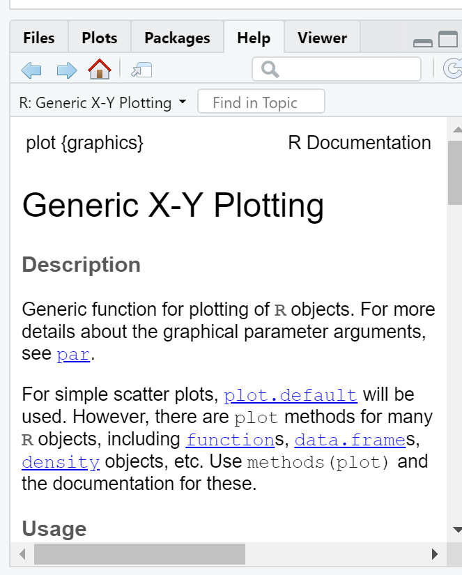

# Practical 2 – Introduction to R

## Learning outcomes

* Examine and clean data
* More advaned data mamipulation 
* Plot graps and maps
* Create interative maps

## Introduction 

This practical is **LONG** but it will take you from not knowing much about R to making freaking cool interactive maps in one practial. As you can imagine, this will be a steep learning curve.

I will give you all the code you need, it’s your job to read through the text very carefully and try to understand what bits of code are doing as you go.

There will be bits of code you don’t fully understand. Don’t worry, the key is to revisit later and try to work out what is going on then. Learning R is a long and iterative process and this is just the start…

If you want to learn more about R and indeed download the latest version for your own use, then visit the R project pages: http://www.r-project.org/

The Wikipedia page for those who want to know a little of the history of R can be found here: http://en.wikipedia.org/wiki/R_(programming_language)

There is an almost endless supply of good R tutorials on the web. If you get stuck or want to learn even more R (and why would you not want to?!), I’d recommend trying some of the following R Tutorial websites:

* http://www.statmethods.net/index.html

* http://www.r-tutor.com/

* http://www.cyclismo.org/tutorial/R/index.html

* http://www.cookbook-r.com/

If you want to really be up to date with the state of the art in R, then https://bookdown.org/ is a fantastic resource. It features free books by some of the pre-eminent names in the R scene - I would urge you to go and take a look.

### Online forums are your friend!!

With almost every problem you encounter with R, someone else will have had the same problem before you and posted it on a forum – someone will then post a solution below.

My usual route is to google the problem and I’ll then be directed to a post, usually on StackOverflow, StackExchange or CrossValidated. When doing so try to think about the minimal working (or not working) example (MWE), by this i mean remove anything very specific to your problem. I’ve rarely not found a solution to a problem this way. 

### Health warning

Beware of posting questions on these forums yourself – contributors to these forums (especially the R ones!), whilst almost always extremely knowledgeable about R, have a bit of a reputation for being insert familiar pejorative term for less-than-polite-human-being here! As you might expect, people who have enough time to become total experts in R, have little time to work on their social skills!! Fortunately though, some other poor chump has usually taken that hit for you and you can still find a useful answer to your problem.

If you are specifically more interested in the spatial side of R, then Alex Singleton and Chris Brunsdon at the Universities of Liverpool and Maynooth also have a number of very useful R Spatial Tutorials – http://rpubs.com/alexsingleton/ & http://rpubs.com/chrisbrunsdon/

Robin Lovelace in Leeds is also frequently at the bleeding edge of developments in R spatial stuff, so keep an eye on his website too: http://robinlovelace.net/. Robin is also in the process of completing a book on GeoComputation in R, which you should definitely read! - https://geocompr.robinlovelace.net/

These websites are also very very good: https://pakillo.github.io/R-GIS-tutorial/ and http://www.maths.lancs.ac.uk/~rowlings/Teaching/UseR2012/cheatsheet.html

### R and RStudio

When you download and install R, you get the R Graphical User Interface (GUI) as standard (below). This is fine and some purists prefer using the clean, unfussy command-line original, but it has some limitations such as no graphical way to view data tables or keep track of what is in your working directory (there are a number of others too).


Fortunately there are a number of software environments that have been developed for R to make it a little more user-friendly; the best of these by a long way is RStudio. RStudio can be downloaded for free from https://www.rstudio.com/. We covered the RStudio layout last week.

### Getting started

If you are some kind of masochist, you are welcome to use the bundled R GUI for all of your work. If pain is not your thing, then for this practical (and future practicals) I will assume that you are using RStudio.

1. From the start menu on your computer, find and run R Studio

Once RStudio has opened, the first thing we will do is create a new project – projects enable you to organise your work effectively and store all of the files you create and work with for a particular task. 
2. To create a new project (and this will vary a little depending on the version of RStudio you are using), either select File > New Project… or Project > Create Project


3. Select Start a project in a brand new working directory and create a new project in a directory of a new ‘wk2’ directory on your N: drive:


My file directory (the second box here) will be different to yours as this is my teaching resources folder. Keep yours simple N:/GIS/wk2.

RStudio should now open with three windows – the main R console on the left, with windows for your environment and files on the right.

### Basics 

1. R has a very steep learning curve, but hopefully it won’t take long to get your head around the basics. For example, at its most simple R can be used as a calculator. In the console window (bottom left), just type the following and press enter:


```r
1+5
```

```
## [1] 6
```

or 


```r
4*5^2
```

```
## [1] 100
```

As you can see R performs these calculations instantly and prints the results in the console. This is useful for quick calculations but less useful for writing scripts requiring multiple operations or saving these for future use.

2. To save your scripts, you should create a new R Script file. Do this now: Select File > New File > R Script.

3. The R Script should open up on the top-left of your GUI. **From now on type everything in this R script file and save it**

### Scripts and some basic commands

4. Usually one of the first things to do when starting a new R Script is to check that you are in the correct working directory. This is important especially if you are working on multiple projects in different locations. To do this type the following into your new empty R Script:


```r
getwd()
```

```
## [1] "N:/Documents/Teaching/CASA0005practicals/CASA0005book"
```

5. To run this line, hold Ctrl (Cmd on a Mac) and press the Return(↲) key (if you are in the standard R installation, you would run your script with Ctrl R). You should now see your current working directory appear in the console.

6. Because of the new project we have already set up, this working directory should be correct, but if for any reason we wanted to change the working directory, we would use the setwd() function. For example, we wanted to change our directory to the documents folder on the C drive, we could run (don’t do this now):


```r
setwd("C:/Documents")
```

7. When we are sure we are working in the correct working directory, we can save our script by clicking on the save icon on the script tab. Save your script as something like “wk2_part1” and you will see it appear in your files window on the right hand side. As you build up a document of R code, you should get into the habit of saving your script periodically in case of an unexpected software crash.

8. We can now begin to write a script without the need to run each line every time we press enter. In the script editor type:


```r
A <- 1
B <- 2
C <- A+B
C
```

```
## [1] 3
```

9. Select (highlight) the three lines and run all three lines with Ctrl Return(↲). You will notice the lines appear in the console (the other window). If you type C and press enter in the console (C and then ctrl return in the script window) you should have the number 3 appear. From now on I recommend you type all the commands below in the script first and then run them. Copying and pasting from this document won’t necessarily work.

10. You will also notice that in RStudio, values A, B and C will appear in your workspace window (top right). These variables are stored in memory for future use. Try giving A and B different values and see what happens. What about if you use lower case letters?

11. You have just demonstrated one of the powerful aspects of R, which is that it is an **object oriented** programming language. A, B and C are all objects that have been assigned a value with the <- symbol (you can also use the = sign, but it operates slightly differently to <- in R, plus the arrow assignment has become standard over the years. Use **alt -** to type it automatically). This principle underlies the whole language and enables users to create ever more complex objects as they progress through their analysis. If you type:


```r
ls()
```

```
## [1] "A" "B" "C"
```
R will produce a list of objects that are currently active.


```r
rm(A)
```

will remove the object A from the workspace (do ls() again to check this or look in your workspace window).

### Functions

12. Both rm() and ls() are known as functions. Functions are the other fundamental aspect to the R language. Functions can be thought of as single or multiple calculations that you apply to objects. They generally take the form of:


```r
function(object, parameter1, parameter2, parameter3...)
```

13. You can write your own functions to carry out tasks (and we’ll come onto that in subsequent practical sessions), but normally you will just used one of the virtually infinite number of functions that other people have already written for us.

### Basic plotting

For example, one common function is the ```plot()``` function for displaying data as a graphical output. Add these lines to your script and run them as before and you can see some ```plot()``` outputs:

```r
#create some datasets, first a vector of 1-100 and 101-200
Data1 <- c(1:100)
Data2 <- c(101:200)
#Plot the data
plot(Data1, Data2, col="red")
```

<!-- -->


```r
#just for fun, create some more, this time some normally distributed
#vectors of 100 numbers
Data3 <- rnorm(100, mean = 53, sd=34)
Data4 <- rnorm(100, mean = 64, sd=14)
#plot
plot(Data3, Data4, col="blue")
```

<!-- -->

14. In the code above, you will have noticed the # symbol. This signifies that whatever comes after it on that line is a comment. Comments are ignored by the R console and they allow you to annotate your code so that you know what it is doing. It is good programming practice to comment your code extensively so that you can keep track of what your scripts are for.

### Help

15. The previous lines of code also demonstrated a number of functions: c() concatenates a string of numbers together into a vector. 1:100 means produce the integers between and including 1:100, the plot() function plots the two data objects and includes a parameter to change the colour of the points. To understand what a function does, you can consult the R Help system. Simply type a question mark and then the function name; for example:


```r
?plot
```



16. In RStudio you will see the help file appear in the Help window in the bottom right of the GUI. Here you can also search for the help files for other functions in the search bar.

### Data types

17. Objects in R can exist as a number of different data types. These include a **matrix**, a **vector**, a **data frame** and a **list**. For the purposes of this practical we will focus on data frames. These are the most flexible data format in R (although tibbles are now becoming popular as well). Data frames can be conceptualised in a similar way to a spreadsheet with data held in rows and columns. They are the most commonly used object type in R and the most straightforward to create from the two vector objects we just created.


```r
df <- data.frame(Data1, Data2)
plot(df, col="green")
```

<!-- -->

18. If you have a very large data frame (thousands or millions of rows) it is useful to see only a selection of these. There are several ways of doing this:


```r
#show the first 10 and then last 10 rows of data in df...
head(df)
```

```
##   Data1 Data2
## 1     1   101
## 2     2   102
## 3     3   103
## 4     4   104
## 5     5   105
## 6     6   106
```


```r
tail(df)
```

```
##     Data1 Data2
## 95     95   195
## 96     96   196
## 97     97   197
## 98     98   198
## 99     99   199
## 100   100   200
```
You can also view elements of your data frame in RStudio by simply clicking on it in the top-right Environment window:


### Elements of a data frame

19. When programming you will frequently want to refer to different elements in a data frame or a vector/list. To select elements of a data frame, or subset it, you can refer specifically to ranges or elements of rows and columns. These are accessed using the single square bracket operator [], with the form:


```r
data.frame[row,column]
```

Rows are always referenced first, before the comma, columns second, after the comma.

20. Try the subsetting your df data frame with the following commands to see what is returned:


```r
df[1:10, 1]
```

```
##  [1]  1  2  3  4  5  6  7  8  9 10
```

```r
df[5:15,]
```

```
##    Data1 Data2
## 5      5   105
## 6      6   106
## 7      7   107
## 8      8   108
## 9      9   109
## 10    10   110
## 11    11   111
## 12    12   112
## 13    13   113
## 14    14   114
## 15    15   115
```

```r
df[c(2,3,6),2]
```

```
## [1] 102 103 106
```

```r
df[,1]
```

```
##   [1]   1   2   3   4   5   6   7   8   9  10  11  12  13  14  15  16  17
##  [18]  18  19  20  21  22  23  24  25  26  27  28  29  30  31  32  33  34
##  [35]  35  36  37  38  39  40  41  42  43  44  45  46  47  48  49  50  51
##  [52]  52  53  54  55  56  57  58  59  60  61  62  63  64  65  66  67  68
##  [69]  69  70  71  72  73  74  75  76  77  78  79  80  81  82  83  84  85
##  [86]  86  87  88  89  90  91  92  93  94  95  96  97  98  99 100
```

21. You will note that the column headings are the names of the original objects creating the data frame. We can change these using the ```colnames()``` function:


```r
colnames(df)<- c("column1", "column2")
```

To select or refer to these columns directly by name, we can either use the ```$``` operator, which takes the form  ```data.frame$columnName```, e.g.


```r
df$column1
```

```
##   [1]   1   2   3   4   5   6   7   8   9  10  11  12  13  14  15  16  17
##  [18]  18  19  20  21  22  23  24  25  26  27  28  29  30  31  32  33  34
##  [35]  35  36  37  38  39  40  41  42  43  44  45  46  47  48  49  50  51
##  [52]  52  53  54  55  56  57  58  59  60  61  62  63  64  65  66  67  68
##  [69]  69  70  71  72  73  74  75  76  77  78  79  80  81  82  83  84  85
##  [86]  86  87  88  89  90  91  92  93  94  95  96  97  98  99 100
```

or we can use the double square bracket operator [[]], and refer to our column by name using quotes e.g.


```r
df[["column1"]]
```

```
##   [1]   1   2   3   4   5   6   7   8   9  10  11  12  13  14  15  16  17
##  [18]  18  19  20  21  22  23  24  25  26  27  28  29  30  31  32  33  34
##  [35]  35  36  37  38  39  40  41  42  43  44  45  46  47  48  49  50  51
##  [52]  52  53  54  55  56  57  58  59  60  61  62  63  64  65  66  67  68
##  [69]  69  70  71  72  73  74  75  76  77  78  79  80  81  82  83  84  85
##  [86]  86  87  88  89  90  91  92  93  94  95  96  97  98  99 100
```

This again is useful if you have a lot of columns and you wish to efficiently extract one of them.

## Reading data into R

One of the most tedious things a spatial analyst / data scientist has to do is clean their data so it doesn’t cause problems for the software later. In the past, we would have needed to do this by hand - these days, we can use software to do much of this for us.

I will now give you two options to arrive at a nice cleaned dataset. If you have issues with software packages etc, you might still need to via the old skool route, however, the new skool route will be much more satisfying if it works!

For this example we are going to use the London Datastore Catalogue.

Go to: https://data.london.gov.uk/dataset/london-datastore-catalogue and download the excel document.

### Old skool cleaning

22. Open the ```LondonData.xls``` file in Excel, and save as ```LondonData.csv``` into your wk2/RProject folder.

23. Open your new ```.csv``` file in Excel. There might be some non-numeric values inside numeric columns which will cause problems in your analysis. These need to be removed before proceeding any further. To remove these, you can use the replace function in Excel. In the home tab under ‘Editing’ open up the find and replace dialogue box and enter the following into the find box:

```#VALUE!``` ```#n/a```

Leave the replace box empty each time and click Replace All to remove these from your file, before saving the file again.

24. Once you have cleaned out all of the trixy characters from the file, to read it into R, we will use the read.csv() function:


```r
LondonDataOSK<- read.csv("prac2_data/london_catalogue.csv")
```

*Note*, i've made an R project for all these practicals, which is why my file path starts with ```prac2_data/```. If you save the ```.csv``` in the same folder as the ```.Rproj``` then you can just use:


```r
LondonDataOSK<- read.csv("LondonData.csv")
```

If you look at the ```read.csv()``` help file - ```?read.csv``` - you will see that we can actually include many more parameters when reading in a .csv file. For example, we could read in the same file as follows:


```r
# by default in R, the file path should be defined with / but on a #windows file system it is defined with \. Using \\ instead allows R #to read the path correctly – alternatively, just use /
LondonDataOSK<- read.csv("prac2_data/london_catalogue.csv", header = TRUE, sep = ",")
```

This would specify the exact path; that the first row of the file contains header information; and the values in the file are separated with commas (not ; or : as can be the case sometimes).

### New skool cleaning 

To clean our data as we read it in, we are going to use a package (more about packages later - for now, just think about it as a lovely gift from the R gods) called readr which comes bundled as part of the tidyverse package. If you want to find out more about the Tidyverse (and you really should) then you should start here: https://www.tidyverse.org/ - the Tidyverse package contains almost everything you need to become a kick-ass data scientist. ‘Tidy’ as a concept in data science is well worth reading about and you should start here with Hadley Wickham’s paper - http://vita.had.co.nz/papers/tidy-data.pdf

Anyway, first install the package:


```r
install.packages("tidyverse", repos = "https://www.stats.bris.ac.uk/R/")
```

Now we can use the ```readr``` package which comes bundled as part of the tidyverse to read in some data (directly from the web this time - read.csv can do this too) and clean text characters out from the numeric columns before they cause problems:


```r
library(tidyverse)
#wang the data in straight from the web using read_csv, skipping over the 'n/a' entries as you go...
LondonData <- read_csv("https://files.datapress.com/london/dataset/ward-profiles-and-atlas/2015-09-24T14:21:24/ward-profiles-excel-version.csv", na = "n/a")
```

**note the use of read_csv here as opposed to read.csv. They are very similar, but read_csv is just a bit better - read this to understand why… Also, for those python fans out there - IT’S NOT THE SAME FUNCTION AS READ_CSV IN PYTHON**

### Examining your new data

25. Your new data has been read in as a data frame / tibble (a tibble is just a data frame with a few extra bells and whistles). If you ever need to check what data type your new data set is, we can use the ```class()``` function:


```r
class(LondonData)
```

```
## [1] "spec_tbl_df" "tbl_df"      "tbl"         "data.frame"
```


```r
# or, if you have your old skool data from step 24 above
class(LondonDataOSK)
```

We can also use the ```class``` function within another two functions (cbind() and lapply()) to check that our data has been read in correctly and that, for example, numeric data haven’t been read in as text or other variables. Run the following line of code:


```r
datatypelist <- data.frame(cbind(lapply(LondonData,class)))
```

You should see that all columns that should be numbers are read in as numeric. Try reading in LondonData again, but this time without excluding the ‘n/a’ values in the file, e.g.


```r
LondonData <- read_csv("https://files.datapress.com/london/dataset/ward-profiles-and-atlas/2015-09-24T14:21:24/ward-profiles-excel-version.csv")
```

Now run the datatypelist function again - you should see that some of the columns (those the n/a values in) have been read in as something other than numeric. This is why we need to exclude them. Isn’t ```readr``` great for helping us avoid reading in our numeric data as text!

```r
LondonData <- edit(LondonData)
```

27. It is also possible to quickly and easily summarise the data or look at the column headers using


```r
summary(df)
```

```
##     column1          column2     
##  Min.   :  1.00   Min.   :101.0  
##  1st Qu.: 25.75   1st Qu.:125.8  
##  Median : 50.50   Median :150.5  
##  Mean   : 50.50   Mean   :150.5  
##  3rd Qu.: 75.25   3rd Qu.:175.2  
##  Max.   :100.00   Max.   :200.0
```


```r
names(LondonData)
```

```
##  [1] "Ward name"                                                                  
##  [2] "Old code"                                                                   
##  [3] "New code"                                                                   
##  [4] "Population - 2015"                                                          
##  [5] "Children aged 0-15 - 2015"                                                  
##  [6] "Working-age (16-64) - 2015"                                                 
##  [7] "Older people aged 65+ - 2015"                                               
##  [8] "% All Children aged 0-15 - 2015"                                            
##  [9] "% All Working-age (16-64) - 2015"                                           
## [10] "% All Older people aged 65+ - 2015"                                         
## [11] "Mean Age - 2013"                                                            
## [12] "Median Age - 2013"                                                          
## [13] "Area - Square Kilometres"                                                   
## [14] "Population density (persons per sq km) - 2013"                              
## [15] "% BAME - 2011"                                                              
## [16] "% Not Born in UK - 2011"                                                    
## [17] "% English is First Language of no one in household - 2011"                  
## [18] "General Fertility Rate - 2013"                                              
## [19] "Male life expectancy -2009-13"                                              
## [20] "Female life expectancy -2009-13"                                            
## [21] "% children in reception year who are obese - 2011/12 to 2013/14"            
## [22] "% children in year 6 who are obese- 2011/12 to 2013/14"                     
## [23] "Rate of All Ambulance Incidents per 1,000 population - 2014"                
## [24] "Rates of ambulance call outs for alcohol related illness - 2014"            
## [25] "Number Killed or Seriously Injured on the roads - 2014"                     
## [26] "In employment (16-64) - 2011"                                               
## [27] "Employment rate (16-64) - 2011"                                             
## [28] "Number of jobs in area - 2013"                                              
## [29] "Employment per head of resident WA population - 2013"                       
## [30] "Rate of new registrations of migrant workers - 2011/12"                     
## [31] "Median House Price (<U+00A3>) - 2014"                                       
## [32] "Number of properties sold - 2014"                                           
## [33] "Median Household income estimate (2012/13)"                                 
## [34] "Number of Household spaces - 2011"                                          
## [35] "% detached houses - 2011"                                                   
## [36] "% semi-detached houses - 2011"                                              
## [37] "% terraced houses - 2011"                                                   
## [38] "% Flat, maisonette or apartment - 2011"                                     
## [39] "% Households Owned - 2011"                                                  
## [40] "% Households Social Rented - 2011"                                          
## [41] "% Households Private Rented - 2011"                                         
## [42] "% dwellings in council tax bands A or B - 2015"                             
## [43] "% dwellings in council tax bands C, D or E - 2015"                          
## [44] "% dwellings in council tax bands F, G or H - 2015"                          
## [45] "Claimant rate of key out-of-work benefits (working age client group) (2014)"
## [46] "Claimant Rate of Housing Benefit (2015)"                                    
## [47] "Claimant Rate of Employment Support Allowance - 2014"                       
## [48] "Rate of JobSeekers Allowance (JSA) Claimants - 2015"                        
## [49] "% dependent children (0-18) in out-of-work households - 2014"               
## [50] "% of households with no adults in employment with dependent children - 2011"
## [51] "% of lone parents not in employment - 2011"                                 
## [52] "(ID2010) - Rank of average score (within London) - 2010"                    
## [53] "(ID2010) % of LSOAs in worst 50% nationally - 2010"                         
## [54] "Average GCSE capped point scores - 2014"                                    
## [55] "Unauthorised Absence in All Schools (%) - 2013"                             
## [56] "% with no qualifications - 2011"                                            
## [57] "% with Level 4 qualifications and above - 2011"                             
## [58] "A-Level Average Point Score Per Student - 2013/14"                          
## [59] "A-Level Average Point Score Per Entry; 2013/14"                             
## [60] "Crime rate - 2014/15"                                                       
## [61] "Violence against the person rate - 2014/15"                                 
## [62] "Deliberate Fires per 1,000 population - 2014"                               
## [63] "% area that is open space - 2014"                                           
## [64] "Cars per household - 2011"                                                  
## [65] "Average Public Transport Accessibility score - 2014"                        
## [66] "% travel by bicycle to work - 2011"                                         
## [67] "Turnout at Mayoral election - 2012"
```

### Data manipulation in R

Now we have some data read into R, we need to select a small subset to work on. The first thing we will do is select just the London Boroughs to work with. If you recall, the Borough data is at the bottom of the file.

#### Selecting rows

29. Your borough data will probably be found between rows 626 and 658. Therefore we will first create a subset by selecting these rows into a new data frame and then reducing that data frame to just four columns. There are a few ways of doing this:

We could select just the rows we need by explicitly specifying the range of rows we need:


```r
LondonBoroughs<-LondonData[626:658,]
```

There is also a ```subset()``` function in R. You could look that up and see whether you could create a subset with that. Or, we could try a cool ‘data sciency’ way of pulling out the rows we want with the knowledge that the codes for London Boroughs start with E09 (the wards in the rest of the file start with E05).

Knowing this, we can use the ```grep()``` function which can use regular expressions to match patterns in text. Let’s try it!


```r
LondonData <- data.frame(LondonData)
LondonBoroughs <- LondonData[grep("^E09",LondonData[,3]),]
```

Check it worked:


```r
head(LondonBoroughs)
```


**AWWMAHGAWD!!!** Pretty cool hey?

What that function is saying is *“grep (get) me all of the rows from the London Data data frame where the text in column 3 starts with (^) E09”*

You will notice that you will have two rows at the top for the City of London. This is becuase it features twice in the data set. That’s fine, we can just drop this row from our dataset:


```r
LondonBoroughs <- LondonBoroughs[2:34,]
```

#### Selecting columns


```r
LondonBoroughs<-LondonBoroughs[,c(1,19,20,21)]
```

30. You will have noticed the use of square brackets above – these are very useful in R. Refer back to points 19-21 above if you can’t remember how they work. The c() function is also used here – this is the ‘combine’ function - another very useful function in R which allows arguments (in this case, column reference numbers) into a single value

#### Renaming columns

31. You will notice that the column names are slightly misleading as we are now working with boroughs rather than wards. We can rename the columns to something more appropriate using the ```names()``` function (there are various other functions for renaming columns - for example ```colnames()``` if you want to rename multiple columns:


```r
#rename the column 1 in LondonBoroughs
names(LondonBoroughs)[1] <- c("Borough Name")
```

### Plotting


```r
plot(LondonBoroughs$Male.life.expectancy..2009.13, LondonBoroughs$X..children.in.reception.year.who.are.obese...2011.12.to.2013.14)
```

<!-- -->

### Pimp my graph!

Now, of course, because this is R, we can pimp this graph using something a bit more fancy than the base graphics functions:


```r
install.packages("plotly", repos = "https://www.stats.bris.ac.uk/R/")
```


```r
library(plotly)
plot_ly(LondonBoroughs, x = ~Male.life.expectancy..2009.13, y = ~X..children.in.reception.year.who.are.obese...2011.12.to.2013.14, text = ~LondonBoroughs$`Borough Name`, type = "scatter", mode = "markers")
```

<!-- -->

### Spatial Data in R

This next part of the practical applies the same principles introduced above to the much more complex problem of handling spatial data within R. In this workshop we will produce a gallery of maps using many of the plotting tools available in R. The resulting maps will not be that meaningful- the focus here is on sound visualisation with R and not sound analysis (I know one is useless without the other!). Good quality spatial analysis will come in the rest of the module.

Whilst the instructions are step by step you are encouraged to start deviating from them (trying different colours for example) to get a better understanding of what we are doing.

#### Packages

In this section we’ll require even more specialist packages, so I should probably spend some more time explaining what packages actually are! Packages are bits of code that extend R beyond the basic statistical functionality it was originally designed for. For spatial data, they enable R to process spatial data formats, carry out analysis tasks and create some of the maps that follow.

Bascially, without packages, R would be very limited. With packages, you can do virtually anything! One of the issues you will come across is that packages are being continually developed and updated and unless you keep your version of R updated and your packages updated, there may be some functions and options not available to you. This can be a problem, particularly with University installations which (at best) may only get updated once a year. Therefore, apologies in advance if things don’t work as intended!

1. In R Studio all packages can be installed and activated in the ‘Packages’ tab in the bottom-right hand window:


2. As with everything else in R though, we can also run everything from the command line. The first package we need to install for this part of the practical is ```maptools``` – either find and install it using the RStudio GUI or do the following:


```r
install.packages("maptools")
```

There are a few other packages we’ll need to get to grips with. Some, like ```ggplot2``` (one of the most influential R packages ever) are part of the ```tidyverse``` package we came across earlier. Others we will need to install for the first time.


```r
install.packages(c("OpenStreetMap", "classInt", "tmap"))

install.packages(c("RColorBrewer", "sp", "rgeos", "tmaptools", "sf", "downloader", "rgdal", "geojsonio"))# might also need these ones
```

4. Now that the packages have been installed you will not have to repeat the above steps again (when you use your account in these cluster rooms). Open a new script and save it to your working directory as “wk3_maps.r”. As before, type each of the lines of code into this window and then select and use the ctrl return keys to run them. Be sure to save your script often.

5. The first task is to load the packages we have just installed. note, you might have some issues with the OpenStreetMap package if your installation of java on your computer doesn’t match your installation of R – e.g. if you have installed the 64bit version of R, you also need the 64bit version of java (same with the 32bit versions) - you may also need to install the package Rcpp separately and try again.

Install Java 64-bit from: https://java.com/en/download/manual.jsp


```r
#Load Packages (ignore any error messages about being built under a #different R version):
library(maptools)
library(RColorBrewer)
library(classInt)
library(OpenStreetMap)
library(sp)
library(rgeos)
library(tmap)
library(tmaptools)
library(sf)
library(rgdal)
library(geojsonio)
```

#### Background to spatial data in R

R has a very well developed ecosystem of packages for working with Spatial Data. Early pioneers like Roger Bivand and Edzer Pebesma along with various colleagues were instrumental in writing packages to interface with some powerful open source libraries for working with spatial data, such as GDAL and GEOS. These were accessed via the ```rgdal``` and ```rgeos``` packages. The  ```maptools``` package by Roger Bivand, amongst other things, allowed Shapefiles to be read into R. The ```sp``` package (along with  ```spdep```) by Edzer Pebesma was very important for defining a series of classes and methods for spatial data natively in R which then allowed others to write software to work with these formats. Other packages like ```raster``` advanced the analysis of gridded spatial data, while packages like ```classint``` and ```RColorbrewer``` facilitated the binning of data and colouring of choropleth maps.

Whilst these packages were extremely important for advancing spatial data analysis in R, they were not always the most straighforward to use - making a map in R could take quite a lot of effort and they were static and visually basic. However, more recently new packages have arrived to change this. Now ```leaflet``` enables R to interface with the leaflet javascript library for online, dynamic maps. ```ggplot2``` which was developed by Hadley Wickam and colleagues radically changed the way that people thought about and created graphical objects in R, including maps, and introduced a graphical style which has been the envy of other software to the extent that there are now libraries in Python which copy the ggplot2 style!

Building on all of these, the new ```tmap``` (Thematic Map) package has changed the game completely and now enables us to read, write and manipulate spatial data and produce visually impressive and interactive maps, very easily. In parallel, the ```sf``` (Simple Features) package is helping us re-think the way that spatial data can be stored and manipulated. It’s exciting times for geographic information / spatial data science!

#### Making some choropleth maps

Choropleth maps are thematic maps which colour areas according to some phenomenon. In our case, we are going to fill some irregular polygons (the London Boroughs) with a colour that corresponds to a particular attribute.

As with all plots in R, there are multiple ways we can do this. The basic ```plot()``` function requires no data preparation but additional effort in colour selection/ adding the map key etc. ```qplot()``` and ```ggplot()``` (installed in the ggplot2 package) require some additional steps to format the spatial data but select colours and add keys etc automatically. Here, we are going to make use of the new ```tmap``` package which makes making maps very easy indeed.

6. So one mega cool thing about R is you can read spatial data in straight from the internetz! Try this below for downloading a GeoJson file:


```r
EW <- geojson_read("http://geoportal.statistics.gov.uk/datasets/8edafbe3276d4b56aec60991cbddda50_2.geojson", what = "sp")
```


```r
#pull out london using grep and the regex wildcard for'start of the string' (^) to to look for the bit of the district code that relates to London (E09) from the 'lad15cd' column in the data slot of our spatial polygons dataframe
LondonMap <- EW[grep("^E09",EW@data$lad15cd),]
#plot it using the base plot function
qtm(LondonMap)
```

<!-- -->

7. Of course, we can also read in our data from a shapefile stored in a local directory:


```r
#read the shapefile into a simple features object
BoroughMapSF <- read_shape("prac1_data/statistical-gis-boundaries-london/ESRI/London_Borough_Excluding_MHW.shp", as.sf = TRUE)
BoroughMapSP <- LondonMap
#plot it very quickly usking qtm (quick thematic map) to check it has been read in correctly
qtm(BoroughMapSF)
```

<!-- -->


```r
qtm(BoroughMapSP)
```

<!-- -->

8. And naturally we can convert between simple features objects and spatialPolygonsDataFrames very easily:


```r
library(methods)
#check the class of BoroughMapSF
class(BoroughMapSF)
```

```
## [1] "sf"         "data.frame"
```


```r
#And check the class of BoroughMapSP
class(BoroughMapSP)
```

```
## [1] "SpatialPolygonsDataFrame"
## attr(,"package")
## [1] "sp"
```


```r
#now convert the SP object into an SF object...
newSF <- st_as_sf(BoroughMapSP)
#and try the other way around SF to SP...
newSP <- as(newSF, "Spatial")
#simples!
BoroughMapSP <- as(BoroughMapSF, "Spatial")
```

#### Attribute data

OK, enough messing around, show us the maps!!

9. Hold your horses, before be can create a map, we need to join some attribute data to some boundaries. Doing this an ```SP``` object can be a bit of a pain, but I’ll show you here:


```r
#join the data to the @data slot in the SP data frame
BoroughMapSP@data <- data.frame(BoroughMapSP@data,LondonData[match(BoroughMapSP@data[,"GSS_CODE"],LondonData[,"New.code"]),])
#check it's joined.
#head(BoroughMapSP@data)
```

10. Joining data is a bit more intuitive with SF:


```r
BoroughDataMap <- append_data(BoroughMapSF,LondonData, key.shp = "GSS_CODE", key.data = "New.code", ignore.duplicates = TRUE)
```

```
## Data contains duplicated keys: E09000001
```

```
## Over coverage: 626 out of 659 data records were not appended. Run over_coverage() to get the corresponding data row numbers and key values.
```

An alternative to append_data would be to use a left-join (like in SQL)


```r
BoroughDataMap2 <- BoroughMapSF %>% left_join(LondonData, by = c("GSS_CODE" = "New.code"))
```

```
## Warning: Column `GSS_CODE`/`New.code` joining factor and character vector,
## coercing into character vector
```

However, you would need to remove the duplicate City of London row afterwards

#### Making some maps

If you want to learn a bit more about the sorts of things you can do with tmap, then there are 2 vignettes that you can access here: https://cran.r-project.org/web/packages/tmap/ - I suggest you refer to these to see the various things you can do using tmap. Here’s a quick sample though:

11. We can create a choropleth map very quickly now using ```qtm```


```r
library(tmap)
library(tmaptools)
tmap_mode("plot")
```

```
## tmap mode set to plotting
```


```r
qtm(BoroughDataMap, fill = "Rate.of.JobSeekers.Allowance..JSA..Claimants...2015")
```

<!-- -->

You can also add a basemap and some other guff, if you wish…


```r
london_osm <- read_osm(BoroughDataMap, type = "esri", zoom = NULL)
qtm(london_osm) + 
  tm_shape(BoroughDataMap) + 
  tm_polygons("Rate.of.JobSeekers.Allowance..JSA..Claimants...2015", 
        style="jenks",
        palette="YlOrBr",
        midpoint=NA,
        title="Rate per 1,000 people",
        alpha = 0.5) + 
  tm_compass(position = c("left", "bottom"),type = "arrow") + 
  tm_scale_bar(position = c("left", "bottom")) +
  tm_layout(title = "Job seekers' Allowance Claimants", legend.position = c("right", "bottom"))
```

<!-- -->

12. how about more than one map, perhaps using different data breaks…


```r
tm_shape(BoroughDataMap) +
    tm_polygons(c("Average.Public.Transport.Accessibility.score...2014", "Violence.against.the.person.rate...2014.15"), 
        style=c("jenks", "pretty"),
        palette=list("YlOrBr", "Purples"),
        auto.palette.mapping=FALSE,
        title=c("Average Public Transport Accessibility", "Violence Against the Person Rate"))
```

```
## Warning: The argument auto.palette.mapping is deprecated. Please use
## midpoint for numeric data and stretch.palette for categorical data to
## control the palette mapping.
```

<!-- -->

You will notice that to choose the colour of the maps, I entered some codes. These are the names of colour ramps from the RColourBrewer package which comes bundled with ```tmap```. ```RColorBrewer``` uses colour palettes available from the colorbrewer2 website (http://colorbrewer2.org/) which is in turn based on the work of Cynthia Brewer and colleagues at Penn State University (http://www.personal.psu.edu/cab38/ColorBrewer/ColorBrewer_updates.html). Cynthia brewer has carried out large amount of academic research into determining the best colour palettes for GIS applications and so we will defer to her expertise here.

If you want to look at the range of colour palettes available, as we; as going to the ColorBrewer website, you can use the a little shiny app which comes bundled with ```tmaptools```


```r
#You might need to install the shinyjs paclage for this to work
install.packages("shinyjs")
```


```r
library(shinyjs)
#it's possible to explicitly tell R which package to get the function from with the :: operator...
tmaptools::palette_explorer()
```

13. ```tmap``` will even let you make a FRICKING INTERACTIVE MAP!!! Oh yes, we can do interactive maps…!


```r
tmap_mode("view")
```

```
## tmap mode set to interactive viewing
```


```r
tm_shape(BoroughDataMap) +
    tm_polygons("X..children.in.year.6.who.are.obese..2011.12.to.2013.14",
        style="cont",
        palette="PuRd",
        midpoint=NA,
        title="Truffle Shuffle Intensity")+
    tmap_options(max.categories = 5)
```

```
## Warning: Number of levels of the variable "X..children.in.year.
## 6.who.are.obese..2011.12.to.2013.14" is 31, which is larger
## than max.categories (which is 5), so levels are combined. Set
## tmap_options(max.categories = 31) in the layer function to show all levels.
```

<!-- -->


```r
####You can even save your map as an html file (uncomment, obvs)
#save_tmap(filename = "truffle.html")
```

#### Have a play around…

There are loads of options for creating maps with ```tmap``` - read the vignettes that have been provided by the developers of the package and see if you can adapt the maps you have just made - or even make some alternative maps using built in data.

https://cran.r-project.org/web/packages/tmap/vignettes/tmap-nutshell.html https://cran.r-project.org/web/packages/tmap/vignettes/tmap-modes.html

You should also read the reference manual on the package homepage: https://cran.r-project.org/web/packages/tmap/

In fact, since I wrote this last year, the ```tmap``` package has developed quite a bit more - have a look at some of the cool examples here: https://github.com/mtennekes/tmap

Have a play and see what cool shiz you can create!

This is an example from the BubbleMap folder on the tmap github. Don't worry about what github is we will cover that soon.


```r
# load spatial data included in the tmap package
data("World", "metro")

# calculate annual growth rate
metro$growth <- (metro$pop2020 - metro$pop2010) / (metro$pop2010 * 10) * 100

# plot
tm_shape(World) +
  tm_polygons("income_grp", palette = "-Blues", 
    title = "Income class", contrast = 0.7, border.col = "gray30", id = "name") +
    tm_text("iso_a3", size = "AREA", col = "gray30", root=3) +
tm_shape(metro) +
  tm_bubbles("pop2010", col = "growth", border.col = "black", 
    border.alpha = 0.5,
    breaks = c(-Inf, 0, 2, 4, 6, Inf) ,
    palette = "-RdYlGn",
    title.size = "Metro population (2010)", 
    title.col = "Annual growth rate (%)",
    id = "name",
    popup.vars=c("pop2010", "pop2020", "growth")) + 
tm_format("World") + 
tm_style("gray")
```

<!-- -->

## Making maps using ggplot2

So as you have seen, it is possible to make very nice thematic maps with ```tmap```. However, there are other options. The  ```ggplot2``` package is a very powerful graphics package that allows us to a huge range of sophisticated plots, including maps.

The latest development version of ```ggplot2``` has support for simple features objects with the new geom_sf class (http://ggplot2.tidyverse.org/reference/ggsf.html), which, quite frankly, is bloody brilliant!

14. If you have not already done so, install and library the ```ggplot2``` and ```rgeos``` packages (they should be installed automatically as part of ```tidyverse``` and ```tmap``` packages, but occasionally they need to be installed separately).

15. Now there are two main ways in which you can construct a plot in  ```ggplot2 ```:  ```qplot() ``` and  ```ggplot() ```.  ```qplot ``` is short for ‘Quick plot’ and can be good for producing quick charts and maps, but is perhaps less good for constructing complex layered plots.  ```ggplot() ``` is better for building up a plot layer by layer, e.g.  ```ggplot()+layer1+layer2 ```, and so this is what we will use here.

16. The important elements of any ```ggplot  ``` layer are the aesthetic mappings – aes(x,y, …) – which tell ggplot where to place the plot objects. We can imagine a map just like a graph with all features mapping to an x and y axis. All geometry (  ```geom_  ```) types in ggplot feature some kind of aesthetic mapping and these can either be declared at the plot level, e.g.


```r
ggplot(data.frame, aes(x=x, y=y))
```

or, more flexibly at the level of the individual geom_ layer, e.g.


```r
geom_polygon(aes(x=x, y=y), data.frame)
```

17. To begin our plot, we will start with the map layer – we will generate this using the geom_sf() function in ```ggplot2```:


```r
ggplot()+geom_sf(mapping = aes(geometry=geometry),data = BoroughDataMap)+theme_minimal()
```

<!-- -->

18. To colour your map, then just pass the name of the variable you want to map to the fill parameter in the aesthetics:


```r
ggplot()+geom_sf(mapping = aes(geometry=geometry, fill=Median.House.Price...U.00A3.....2014),data = BoroughDataMap)+theme_minimal()
```

<!-- -->

19. As you can see, this map looks OK, but there are a few issues with things like the colour ramp and a lack of appropriate labels. We can correct this by adding a few more layers. Firstly we can change the palette:


```r
palette1<-scale_fill_continuous(low="white", high="orange", "Price(£)")
```

20. And some appropriate labels:


```r
labels<-labs(title="Average House Price 2014",x="Longitude", y="Latitude")
```

21. Before plotting the all of them together:


```r
ggplot()+geom_sf(mapping = aes(geometry=geometry, fill=Median.House.Price...U.00A3.....2014),data = BoroughDataMap)+theme_minimal()+palette1+labels
```

<!-- -->

### Changing projections

Now until now, we’ve not really considered how our maps have been printed to the screen. The coordinates stored in the ```geometry``` column of your ```sf``` object contain the information to enable points, lines or polygons to be drawn on the screen (think back to the KML exercise in week 1). The ```ggplot``` map above could fool you into thinking the coordinate system we are using is latitude and longitude, but actually, the map coordinates are stored in British National Grid. How can we tell?

You can check that the coordinate reference systems of  ```sf ``` or  ```sp ``` objects using the print function:


```r
print(BoroughMapSP)
```

```
## class       : SpatialPolygonsDataFrame 
## features    : 33 
## extent      : 503568.2, 561957.5, 155850.8, 200933.9  (xmin, xmax, ymin, ymax)
## crs         : +proj=tmerc +lat_0=49 +lon_0=-2 +k=0.999601272 +x_0=400000 +y_0=-100000 +ellps=airy +towgs84=446.448,-125.157,542.06,0.1502,0.247,0.8421,-20.4894 +units=m +no_defs 
## variables   : 74
## names       :                 NAME,  GSS_CODE,  HECTARES, NONLD_AREA, ONS_INNER, SUB_2009, SUB_2006,            Ward.name, Old.code,  New.code, Population...2015, Children.aged.0.15...2015, Working.age..16.64....2015, Older.people.aged.65....2015, X..All.Children.aged.0.15...2015, ... 
## min values  : Barking and Dagenham, E09000001,   314.942,          0,         F,       NA,       NA, Barking and Dagenham,     00AA, E09000001,              8100,                       650,                       6250,                         1250,                                8, ... 
## max values  :          Westminster, E09000033, 15013.487,    370.619,         T,       NA,       NA,          Westminster,     00BK, E09000033,            393200,                     82900,                     257850,                        56550,                             26.1, ...
```


```r
print(BoroughMapSF)
```

```
## Simple feature collection with 33 features and 7 fields
## geometry type:  MULTIPOLYGON
## dimension:      XY
## bbox:           xmin: 503568.2 ymin: 155850.8 xmax: 561957.5 ymax: 200933.9
## epsg (SRID):    NA
## proj4string:    +proj=tmerc +lat_0=49 +lon_0=-2 +k=0.999601272 +x_0=400000 +y_0=-100000 +ellps=airy +towgs84=446.448,-125.157,542.06,0.1502,0.247,0.8421,-20.4894 +units=m +no_defs
## First 10 features:
##                   NAME  GSS_CODE  HECTARES NONLD_AREA ONS_INNER SUB_2009
## 0 Kingston upon Thames E09000021  3726.117      0.000         F     <NA>
## 1              Croydon E09000008  8649.441      0.000         F     <NA>
## 2              Bromley E09000006 15013.487      0.000         F     <NA>
## 3             Hounslow E09000018  5658.541     60.755         F     <NA>
## 4               Ealing E09000009  5554.428      0.000         F     <NA>
## 5             Havering E09000016 11445.735    210.763         F     <NA>
## 6           Hillingdon E09000017 11570.063      0.000         F     <NA>
## 7               Harrow E09000015  5046.330      0.000         F     <NA>
## 8                Brent E09000005  4323.270      0.000         F     <NA>
## 9               Barnet E09000003  8674.837      0.000         F     <NA>
##   SUB_2006                       geometry
## 0     <NA> MULTIPOLYGON (((516401.6 16...
## 1     <NA> MULTIPOLYGON (((535009.2 15...
## 2     <NA> MULTIPOLYGON (((540373.6 15...
## 3     <NA> MULTIPOLYGON (((521975.8 17...
## 4     <NA> MULTIPOLYGON (((510253.5 18...
## 5     <NA> MULTIPOLYGON (((549893.9 18...
## 6     <NA> MULTIPOLYGON (((510599.8 19...
## 7     <NA> MULTIPOLYGON (((510599.8 19...
## 8     <NA> MULTIPOLYGON (((525201 1825...
## 9     <NA> MULTIPOLYGON (((524579.9 19...
```

#### Proj4

If you’re a spatial geek and you’re used to looking at London, then a quick glance at the values of the extent / bounding box (bbox) will tell you that you are working in British National Grid as the x and y values are in 6 Figures, with x values around 52000 to 55000 and y values around 15000 to 20000. The other way of telling is by looking at the coordinate reference system (CRS) value - in the files above it’s defined by the bit that says:

```+proj=tmerc +lat_0=49 +lon_0=-2 +k=0.9996012717 +x_0=400000 +y_0=-100000 +ellps=airy```

“Well that’s clear as mud!” I hear you cry! Yes, not obvious is it! This is called a proj-string or proj4-string and its the proj4-string for British National Grid. You can learn what each of the bits of this mean here: https://proj4.org/usage/quickstart.html

The proj4-string basically tells the computer where on the earth to locate the coordinates that make up the geometries in your file and what distortions to apply (i.e. if to flatten it out completely etc.)

24. Sometimes you can download data from the web and it doesn’t have a CRS . If any boundary data you download does not have a coordinate reference system attached to it (NA is displayed in the coord. ref section), this is not a huge problem - it can be added afterwards by adding the proj4string to the file.

To find the proj4-strings for a whole range of different geographic projections, use the search facility at http://spatialreference.org/ or http://epsg.io/.

#### EPSG

Now, if you can store a whole proj4-string in your mind, you must be some kind of savant (why are you doing this course? you could make your fortune as a card-counting poker player or something!). The rest of us need something a little bit more easy to remember and for coordinate reference systems, the saviour is the European Petroleum Survey Group (EPSG) - (naturally!). Now managed and maintained by the International Association of Oil and Gas producers - http://www.epsg.org/ - EPSG codes are short numbers represent all coordinate reference systems in the world and link directly to proj4 strings.

The EPSG code for British National Grid is 27700 - http://epsg.io/27700. The EPSG code for the WGS84 World Geodetic System (usually the default CRS for most spatial data) is 4326 - http://epsg.io/4326

26. If your boundary data doesn’t have a spatial reference system, you can read it in you can read it in and set the projection either with the full proj4 string, or, more easily, with the EPSG code:


```r
# read borough map in and explicitly set projection to British National Grid 
# using the EPSG string code 27700
BoroughMapSP <- read_shape("prac1_data/statistical-gis-boundaries-london/ESRI/London_Borough_Excluding_MHW.shp", current.projection = 27700)
```

```
## Warning: Projection already specified in shape file. Use set_projection for
## reprojection.
```


```r
#or, for SF
BoroughMapSF <- st_read("prac1_data/statistical-gis-boundaries-london/ESRI/London_Borough_Excluding_MHW.shp") %>% st_set_crs(27700)
```

```
## Reading layer `London_Borough_Excluding_MHW' from data source `N:\Documents\Teaching\CASA0005practicals\CASA0005book\prac1_data\statistical-gis-boundaries-london\ESRI\London_Borough_Excluding_MHW.shp' using driver `ESRI Shapefile'
## Simple feature collection with 33 features and 7 fields
## geometry type:  MULTIPOLYGON
## dimension:      XY
## bbox:           xmin: 503568.2 ymin: 155850.8 xmax: 561957.5 ymax: 200933.9
## epsg (SRID):    NA
## proj4string:    +proj=tmerc +lat_0=49 +lon_0=-2 +k=0.999601272 +x_0=400000 +y_0=-100000 +datum=OSGB36 +units=m +no_defs
```

```
## Warning: st_crs<- : replacing crs does not reproject data; use st_transform
## for that
```

27. Another option is to assign the coordinates reference system after the shapefile has been read in, for example. However as we have already assigned a CRS to BoroughMapSP R in the fucntion read_shape R will through an error. So let's read the shape again using ```readOGR ``` from the rgdal package:


```r
BoroughMapSP <- readOGR("prac1_data/statistical-gis-boundaries-london/ESRI/London_Borough_Excluding_MHW.shp")
```

```
## OGR data source with driver: ESRI Shapefile 
## Source: "N:\Documents\Teaching\CASA0005practicals\CASA0005book\prac1_data\statistical-gis-boundaries-london\ESRI\London_Borough_Excluding_MHW.shp", layer: "London_Borough_Excluding_MHW"
## with 33 features
## It has 7 fields
```

```r
#create a variable for the EPSG code to reference the proj4string (EPSG codes are shorter and easier to remember than the full strings!) and store it in a variable...
UKBNG <- "+init=epsg:27700"
#now set the proj4string for your BoroughMap object - note, this will probably throw an error if your dataset already has a CRS, this is just for demonstration...
proj4string(BoroughMapSP) <- CRS(UKBNG)
```


```r
print(BoroughMapSP) # check for new CRS
```

```
## class       : SpatialPolygonsDataFrame 
## features    : 33 
## extent      : 503568.2, 561957.5, 155850.8, 200933.9  (xmin, xmax, ymin, ymax)
## crs         : +init=epsg:27700 +proj=tmerc +lat_0=49 +lon_0=-2 +k=0.9996012717 +x_0=400000 +y_0=-100000 +datum=OSGB36 +units=m +no_defs +ellps=airy +towgs84=446.448,-125.157,542.060,0.1502,0.2470,0.8421,-20.4894 
## variables   : 7
## names       :                 NAME,  GSS_CODE,  HECTARES, NONLD_AREA, ONS_INNER, SUB_2009, SUB_2006 
## min values  : Barking and Dagenham, E09000001,   314.942,          0,         F,       NA,       NA 
## max values  :          Westminster, E09000033, 15013.487,    370.619,         T,       NA,       NA
```

or for ```SF```:


```r
BoroughMapSF <- BoroughMapSF %>% st_set_crs(27700)
print(BoroughMapSF)
```

```
## Simple feature collection with 33 features and 7 fields
## geometry type:  MULTIPOLYGON
## dimension:      XY
## bbox:           xmin: 503568.2 ymin: 155850.8 xmax: 561957.5 ymax: 200933.9
## epsg (SRID):    27700
## proj4string:    +proj=tmerc +lat_0=49 +lon_0=-2 +k=0.9996012717 +x_0=400000 +y_0=-100000 +ellps=airy +towgs84=446.448,-125.157,542.06,0.15,0.247,0.842,-20.489 +units=m +no_defs
## First 10 features:
##                    NAME  GSS_CODE  HECTARES NONLD_AREA ONS_INNER SUB_2009
## 1  Kingston upon Thames E09000021  3726.117      0.000         F     <NA>
## 2               Croydon E09000008  8649.441      0.000         F     <NA>
## 3               Bromley E09000006 15013.487      0.000         F     <NA>
## 4              Hounslow E09000018  5658.541     60.755         F     <NA>
## 5                Ealing E09000009  5554.428      0.000         F     <NA>
## 6              Havering E09000016 11445.735    210.763         F     <NA>
## 7            Hillingdon E09000017 11570.063      0.000         F     <NA>
## 8                Harrow E09000015  5046.330      0.000         F     <NA>
## 9                 Brent E09000005  4323.270      0.000         F     <NA>
## 10               Barnet E09000003  8674.837      0.000         F     <NA>
##    SUB_2006                       geometry
## 1      <NA> MULTIPOLYGON (((516401.6 16...
## 2      <NA> MULTIPOLYGON (((535009.2 15...
## 3      <NA> MULTIPOLYGON (((540373.6 15...
## 4      <NA> MULTIPOLYGON (((521975.8 17...
## 5      <NA> MULTIPOLYGON (((510253.5 18...
## 6      <NA> MULTIPOLYGON (((549893.9 18...
## 7      <NA> MULTIPOLYGON (((510599.8 19...
## 8      <NA> MULTIPOLYGON (((510599.8 19...
## 9      <NA> MULTIPOLYGON (((525201 1825...
## 10     <NA> MULTIPOLYGON (((524579.9 19...
```

#### Reprojecting your spatial data

Reprojecting your data is something that you might have to (or want to) do, on occasion. Why? Well, one example might be if you want to measure the distance of a line object, or the distance between two polygons. This can be done far more easily in a projected coordinate system like British National Grid (where the units are measured in metres) than it can a geographic coordiante system such as WGS84 (where the units are degrees).

For generating maps in packages like ```leaflet```, your maps will also need to be in WGS84, rather than British National Grid.

28. So once your data has a coordinates system to work with, we can re-project or transfrom to anything we like. The most commonly used is the global latitude and longitude system (WGS84). With SP objects, this is carried out using the ```spTransform() ``` function:


```r
BoroughMapSPWGS84 <-spTransform(BoroughMapSP, CRS("+proj=longlat +datum=WGS84"))
print(BoroughMapSPWGS84)
```

```
## class       : SpatialPolygonsDataFrame 
## features    : 33 
## extent      : -0.5103751, 0.3340155, 51.28676, 51.69187  (xmin, xmax, ymin, ymax)
## crs         : +proj=longlat +datum=WGS84 +ellps=WGS84 +towgs84=0,0,0 
## variables   : 7
## names       :                 NAME,  GSS_CODE,  HECTARES, NONLD_AREA, ONS_INNER, SUB_2009, SUB_2006 
## min values  : Barking and Dagenham, E09000001,   314.942,          0,         F,       NA,       NA 
## max values  :          Westminster, E09000033, 15013.487,    370.619,         T,       NA,       NA
```


```r
#transform it back again:
BoroughMapSPBNG <-spTransform(BoroughMapSP, CRS(UKBNG))
print(BoroughMapSPBNG)
```

```
## class       : SpatialPolygonsDataFrame 
## features    : 33 
## extent      : 503568.2, 561957.5, 155850.8, 200933.9  (xmin, xmax, ymin, ymax)
## crs         : +init=epsg:27700 +proj=tmerc +lat_0=49 +lon_0=-2 +k=0.9996012717 +x_0=400000 +y_0=-100000 +datum=OSGB36 +units=m +no_defs +ellps=airy +towgs84=446.448,-125.157,542.060,0.1502,0.2470,0.8421,-20.4894 
## variables   : 7
## names       :                 NAME,  GSS_CODE,  HECTARES, NONLD_AREA, ONS_INNER, SUB_2009, SUB_2006 
## min values  : Barking and Dagenham, E09000001,   314.942,          0,         F,       NA,       NA 
## max values  :          Westminster, E09000033, 15013.487,    370.619,         T,       NA,       NA
```


```r
#You may want to create a similar variable for WGS84
latlong <- "+init=epsg:4326"
```

And for SF objects it’s carried out using ```st_transform```:


```r
BoroughMapSFWGS84 <- st_transform(BoroughMapSF, 4326)
print(BoroughMapSFWGS84)
```

```
## Simple feature collection with 33 features and 7 fields
## geometry type:  MULTIPOLYGON
## dimension:      XY
## bbox:           xmin: -0.5103751 ymin: 51.28676 xmax: 0.3340156 ymax: 51.69187
## epsg (SRID):    4326
## proj4string:    +proj=longlat +datum=WGS84 +no_defs
## First 10 features:
##                    NAME  GSS_CODE  HECTARES NONLD_AREA ONS_INNER SUB_2009
## 1  Kingston upon Thames E09000021  3726.117      0.000         F     <NA>
## 2               Croydon E09000008  8649.441      0.000         F     <NA>
## 3               Bromley E09000006 15013.487      0.000         F     <NA>
## 4              Hounslow E09000018  5658.541     60.755         F     <NA>
## 5                Ealing E09000009  5554.428      0.000         F     <NA>
## 6              Havering E09000016 11445.735    210.763         F     <NA>
## 7            Hillingdon E09000017 11570.063      0.000         F     <NA>
## 8                Harrow E09000015  5046.330      0.000         F     <NA>
## 9                 Brent E09000005  4323.270      0.000         F     <NA>
## 10               Barnet E09000003  8674.837      0.000         F     <NA>
##    SUB_2006                       geometry
## 1      <NA> MULTIPOLYGON (((-0.330679 5...
## 2      <NA> MULTIPOLYGON (((-0.0640212 ...
## 3      <NA> MULTIPOLYGON (((0.01213098 ...
## 4      <NA> MULTIPOLYGON (((-0.2445624 ...
## 5      <NA> MULTIPOLYGON (((-0.4118326 ...
## 6      <NA> MULTIPOLYGON (((0.1586929 5...
## 7      <NA> MULTIPOLYGON (((-0.4040719 ...
## 8      <NA> MULTIPOLYGON (((-0.4040719 ...
## 9      <NA> MULTIPOLYGON (((-0.1965687 ...
## 10     <NA> MULTIPOLYGON (((-0.1998964 ...
```

In the SF object, you can compare the values in the geometry column with those in the original file to look at how they have changed…

### Maps with extra features

Now we can re-project our data, it frees us up to bring in, for example, different base maps and other stuff, a bit like ```tmap```.


```r
#install.packages("ggmap")
library(ggmap)

BoroughDataMap <- append_data(BoroughMapSFWGS84,LondonData, key.shp = "GSS_CODE", key.data = "New.code", ignore.duplicates = TRUE)

londonbbox1 <- c(left = -0.5103766, bottom = 51.28676, right = 0.3340146, top = 51.69187)

londonbbox2 <- as.vector(st_bbox(BoroughMapSFWGS84))

#this bit of code uses the box we specified and gets map tiles from Stamen Maps (http://maps.stamen.com/#terrain/12/37.7706/-122.3782)

# try changing the maptype to watercolor
map <- get_stamenmap(londonbbox2, zoom = 10, maptype = "toner-lite")

ggmap(map) + geom_sf(mapping = aes(geometry=geometry, fill=Median.House.Price...U.00A3.....2014),data = BoroughDataMap, inherit.aes = FALSE,alpha=0.7)+theme_minimal()+palette1+labels
```

<!-- -->

### Extension

#### Faceted plots

One of the nice features of ggplot2 is its faceting function which allows you to lay out subsets of your data in different panels of a grid.

See if you can create a faceted grid of London maps like the one shown below. To do this, you will need to go through several stages:

1. You will need to subset your Borough_geom data frame so that it only contains data on the same scale (you have a number of columns that show percentages, for example) – you can show facets on different scales, but we will leave this for the time being.

2. You will also need to make sure your subset includes a few columns of key ID information data at the beginning – e.g. ID and geometry.

3. You will then need to use the reshape2 package to reformat your data using the ```melt()``` function, with an argument to specify the columns where your ID data ends (all columns afterwards containing data you want to plot). A call something like:


```r
#warning, this is messy, but it sort-of works...
library(reshape2)
```

```
## 
## Attaching package: 'reshape2'
```

```
## The following object is masked from 'package:tidyr':
## 
##     smiths
```

```r
library(dplyr)
#use melt to bung all of the variables into a single column on top of each other, but leave out the geometry column or it will throw an error. Make sure you know which coloumn holds the geometry.I'm only going to select 10 coloumns of data here (measure.vars=10:20).

borough_melt <- melt(BoroughDataMap,id.vars = 1:9, measure.vars = 10:20)

#have a look at borough_melt now - in this circumstance i find the best way is to click on the data in the enviroment window (top right), what do you notice?

#now join the geometry column back on - you will have to join it along with all of the data again.
borough_melt <- left_join(borough_melt,BoroughDataMap,by = c("GSS_CODE" = "GSS_CODE"))

#here i'm removing everything except the variable coloumn, values and the geometry inforamtion
borough_melt <- borough_melt[,c(10:11,84)]

library(tmap)
library(sf)
library(maptools)

tmap_mode("plot")
```

```
## tmap mode set to plotting
```

```r
borough_melt <- st_as_sf(borough_melt)

qtm(borough_melt, fill = "value", by = "variable")
```

<!-- -->

or, indeed, in ggplot2 like this:


```r
ggplot()+geom_sf(mapping = aes(geometry=geometry, fill=value),data = borough_melt)+facet_wrap(~variable)
```

<!-- -->

#### Interactive web maps

So we created an interactive map with ```tmap``` earlier and that was pretty cool, but if we want to do even more mind-blowing stuff later on in the course, we will need to get our heads around how to do interactive maps using ```leaflet```.

Leaflet is a Java Script library for producing interactive web maps, and some enterprising coders over at RStudio have produced a package for allowing you to create your own Leaflet maps. All of the documentation for the R Leaflet package can be found here: https://rstudio.github.io/leaflet/


```r
library(leaflet)
```


```r
library(sf)
library(sp)
library(magrittr)
```

```
## 
## Attaching package: 'magrittr'
```

```
## The following object is masked from 'package:ggmap':
## 
##     inset
```

```
## The following object is masked from 'package:purrr':
## 
##     set_names
```

```
## The following object is masked from 'package:tidyr':
## 
##     extract
```

```r
library(classInt)
```

##### Generating a colour ramp and palette

Before we create a leaflet map, we need to specify what the breaks in our data are going to be…


```r
colours<- brewer.pal(5, "Blues")
breaks<-classIntervals(BoroughDataMap$Claimant.Rate.of.Housing.Benefit..2015., n=5, style="jenks")
graphics::plot(breaks, pal=colours)
```

<!-- -->

So we have now created a breaks object which uses the jenks natural breaks algorithm to divide up our variable into 5 classes. You will notice that breaks is a list of 2 objects. We want only the ```brks``` bit which contains the values for the breaks


```r
summary(breaks)
```

```
##      Length Class  Mode   
## var  33     -none- numeric
## brks  6     -none- numeric
```


```r
breaks <- as.numeric(breaks$brks)
```

Now we can create out leaflet interactive map.

Here you will see that I am using different syntax to that which has gone before. The %>% (pipe) operator is part of the magrittr package - https://cran.r-project.org/web/packages/magrittr/vignettes/magrittr.html. magrittr is an entirely new way of thinking about R syntax. Read up on it if you wish, but for now it is useful to think of the pipe operator as simply meaning “then”. Do this THEN do this THEN do that.


```r
#create a new sp object from the earlier sf object with all of our data in THEN Transform it to WGS84 THEN convert it to SP.  

BoroughDataMapSP <- BoroughDataMap %>%
  st_transform(crs = 4326) %>%
  as("Spatial")

#create a colour palette using colorBin colour mapping
pal <- colorBin(palette = "YlOrRd", 
                domain = BoroughDataMapSP$Claimant.Rate.of.Housing.Benefit..2015.,
                #create bins using the breaks object from earlier
                bins = breaks)
# now, add some polygons colour them using your colour palette, #overlay the, on top of a nice backdrop and add a legend. Note the #use of the magrittr pipe operator (%>%) – check the documentation #to understand how this is working…
leaflet(BoroughDataMapSP) %>%
  addPolygons(stroke = FALSE, 
              fillOpacity = 0.5, 
              smoothFactor = 0.5,
              color = ~pal(Claimant.Rate.of.Housing.Benefit..2015.),
              popup = ~NAME
  ) %>%
  addProviderTiles("CartoDB.DarkMatter") %>%
  addLegend("bottomright", 
            pal= pal, 
            values = ~Claimant.Rate.of.Housing.Benefit..2015., 
            title = "Housing Benefit Claimant Rate", 
            labFormat = labelFormat(prefix = "Per 1,000 people "),
            opacity = 1
  )
```

<!-- -->

