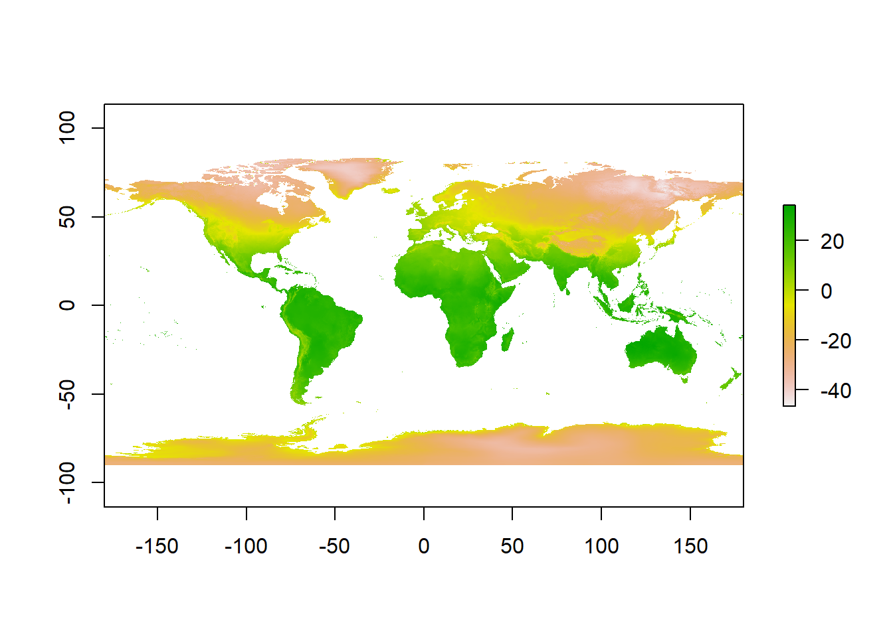
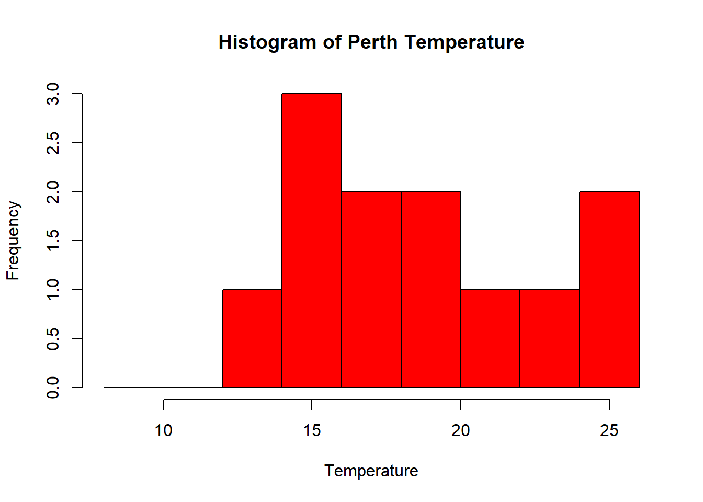

# Rasters and descriptive statistics

## Learning outcomes

* Examine and clean data
* More advanced data manipulation 
* Plot graphs and maps
* Create interactive maps

## Introduction

So far we've only really considered vector data. Within this practical we will explore some raster data sources and processing techniques. If you recall rasters are grids of cell with individual values. There are many, many possible sources to obtain raster data from as it is the data type used for the majority of remote sensing data (well all but LiDAR - which we will get onto). 

## WorldClim data

To start with we are going to use WorldClim data --- this is a set of free global climate layers (rasters) with a spatial resolution of between 1 $$km^2$$ and 240 $$km^2$$.

To download the data go to: http://worldclim.org/version2

Select any variable you want at the 5 minute second resolution. What is a 5 minute resolution i hear you ask? Well, this geographic reference system treats the globe as if it was a sphere divided into 360 equal parts called degrees. Each degree has 60 minutes and each minute has 60 seconds. Arc-seconds of latitude remain basically almost constant whilst arc-seconds of longitude decrease in a trigonometric cosine-based fashion as you move towards the Earth's poles....


Unzip and move the data to your project folder. Now load the data. We could do this individually....


```r
library(raster)
```

```
## Loading required package: sp
```

```r
jan=raster("prac3_data/wc2.0_5m_tavg_01.tif")
# have a look at the raster layer jan
jan
```

```
## class      : RasterLayer 
## dimensions : 2160, 4320, 9331200  (nrow, ncol, ncell)
## resolution : 0.08333333, 0.08333333  (x, y)
## extent     : -180, 180, -90, 90  (xmin, xmax, ymin, ymax)
## crs        : +proj=longlat +datum=WGS84 +no_defs +ellps=WGS84 +towgs84=0,0,0 
## source     : N:/Documents/Teaching/CASA0005practicals/CASA0005book/prac3_data/wc2.0_5m_tavg_01.tif 
## names      : wc2.0_5m_tavg_01 
## values     : -46.697, 34.291  (min, max)
```

Then have a quick look at the data


```r
plot(jan)
```



However, a better and more efficient way is to firstly list all the files we are interested stored within our directory


```r
listfiles <- list.files("prac3_data", ".tif", full.names=TRUE)

#have a look at the file names 
listfiles
```

```
##  [1] "prac3_data/wc2.0_5m_tavg_01.tif" "prac3_data/wc2.0_5m_tavg_02.tif"
##  [3] "prac3_data/wc2.0_5m_tavg_03.tif" "prac3_data/wc2.0_5m_tavg_04.tif"
##  [5] "prac3_data/wc2.0_5m_tavg_05.tif" "prac3_data/wc2.0_5m_tavg_06.tif"
##  [7] "prac3_data/wc2.0_5m_tavg_07.tif" "prac3_data/wc2.0_5m_tavg_08.tif"
##  [9] "prac3_data/wc2.0_5m_tavg_09.tif" "prac3_data/wc2.0_5m_tavg_10.tif"
## [11] "prac3_data/wc2.0_5m_tavg_11.tif" "prac3_data/wc2.0_5m_tavg_12.tif"
```

Then load all of the data straight into a raster stack. A raster stack is a collection of raster layers with the same spatial extent and resolution.

```r
worldclimtemp <- stack(listfiles)
#have a look at the raster stack
worldclimtemp
```

```
## class      : RasterStack 
## dimensions : 2160, 4320, 9331200, 12  (nrow, ncol, ncell, nlayers)
## resolution : 0.08333333, 0.08333333  (x, y)
## extent     : -180, 180, -90, 90  (xmin, xmax, ymin, ymax)
## crs        : +proj=longlat +datum=WGS84 +no_defs +ellps=WGS84 +towgs84=0,0,0 
## names      : wc2.0_5m_tavg_01, wc2.0_5m_tavg_02, wc2.0_5m_tavg_03, wc2.0_5m_tavg_04, wc2.0_5m_tavg_05, wc2.0_5m_tavg_06, wc2.0_5m_tavg_07, wc2.0_5m_tavg_08, wc2.0_5m_tavg_09, wc2.0_5m_tavg_10, wc2.0_5m_tavg_11, wc2.0_5m_tavg_12 
## min values :          -46.697,          -44.559,          -57.107,          -62.996,          -63.541,          -63.096,          -66.785,          -64.600,          -62.600,          -54.400,          -42.000,          -45.340 
## max values :           34.291,           33.174,           33.904,           34.629,           36.312,           38.400,           43.036,           41.073,           36.389,           33.869,           33.518,           33.667
```

So if the raster stack you'll notice that under dimensions there are 12 layers (nlayers). The stack has loaded the 12 months of average temperature data for us in order. To access single layers within the stack:


```r
# access the january layer
worldclimtemp[[1]]
```

```
## class      : RasterLayer 
## dimensions : 2160, 4320, 9331200  (nrow, ncol, ncell)
## resolution : 0.08333333, 0.08333333  (x, y)
## extent     : -180, 180, -90, 90  (xmin, xmax, ymin, ymax)
## crs        : +proj=longlat +datum=WGS84 +no_defs +ellps=WGS84 +towgs84=0,0,0 
## source     : N:/Documents/Teaching/CASA0005practicals/CASA0005book/prac3_data/wc2.0_5m_tavg_01.tif 
## names      : wc2.0_5m_tavg_01 
## values     : -46.697, 34.291  (min, max)
```

We can also rename our layers:


```r
month <- c("Jan", "Feb", "Mar", "Apr", "May", "Jun", "Jul", "Aug", "Sep", "Oct", "Nov", "Dec")
names(worldclimtemp) <- month
```

Now we could also use the following to access just the January raster layer


```r
worldclimtemp$Jan
```

```
## class      : RasterLayer 
## dimensions : 2160, 4320, 9331200  (nrow, ncol, ncell)
## resolution : 0.08333333, 0.08333333  (x, y)
## extent     : -180, 180, -90, 90  (xmin, xmax, ymin, ymax)
## crs        : +proj=longlat +datum=WGS84 +no_defs +ellps=WGS84 +towgs84=0,0,0 
## source     : N:/Documents/Teaching/CASA0005practicals/CASA0005book/prac3_data/wc2.0_5m_tavg_01.tif 
## names      : Jan 
## values     : -46.697, 34.291  (min, max)
```

## Point data from a raster

Using a raster stack we can extract data with a single command from the entire stack, for example let's make a dataframe of some sample sites --- Australian cities.


```r
site <- c("Brisbane", "Melbourne", "Perth", "Sydney", "Broome", "Darwin", "Orange", "Bunbury", "Cairns", "Adelaide", "Gold Coast", "Canberra", "Newcastle", "Wollongong", "Logan City" )
lon <- c(153.03, 144.96, 115.86, 151.21, 122.23, 130.84, 149.10, 115.64, 145.77, 138.6, 153.43, 149.13, 151.78, 150.89, 153.12)
lat <- c(-27.47, -37.91, -31.95, -33.87, 17.96, -12.46, -33.28, -33.33, -16.92, -34.93, -28, -35.28, -32.93, -34.42, -27.64)
samples <- data.frame(site, lon, lat, row.names="site")
# Extract data from RasterLayer
AUcitytemp<- extract(worldclimtemp, samples)
```

Let's also add the city names to the rows of AUcitytemp

```r
row.names(AUcitytemp)<-site
```

Now we're going to look at some basic descriptive statistics. To start with let's take Perth as an example. We can subset our data either using the row name:


```r
Perthtemp <- subset(AUcitytemp, rownames(AUcitytemp) == "Perth")
```

Or the row location:


```r
Perthtemp <- AUcitytemp[3,]
```

## Descriptive statistics

Descriptive statistics provide a summary of our data often forming the base of quantitiatve analysis leading to inferential statistics which we use to make infereces about our data (e.g. make judegements of the porbability that the observed difference between two datasets is not by chance) 

### Histogram

A histogram lets us see the frequency of distribution of our data:


```r
hist(Perthtemp)
```


Remember what we're looking at here. The ```x``` axis is the temperature and the ```y``` is the frequency of occurrence. That's a pretty simple histogram, let's improve the aesthetics 


```r
userbreak<-c(8,10,12,14,16,18,20,22,24,26)
hist(Perthtemp, breaks=userbreak, col="red")
```



Have a look at the histogram information R generated


```r
histinfo<-hist(Perthtemp)
```


```r
histinfo
```

```
## $breaks
## [1] 12 14 16 18 20 22 24 26
## 
## $counts
## [1] 1 3 2 2 1 1 2
## 
## $density
## [1] 0.04166667 0.12500000 0.08333333 0.08333333 0.04166667 0.04166667
## [7] 0.08333333
## 
## $mids
## [1] 13 15 17 19 21 23 25
## 
## $xname
## [1] "Perthtemp"
## 
## $equidist
## [1] TRUE
## 
## attr(,"class")
## [1] "histogram"
```

Here we have:

* breaks --- the cut off points for the bins (or bars), we just specified these
* counts --- the number of cells in each bin
* midpoints --- the middle value for each bin
* density --- the density of data per bin

### Using more data

This was a rather basic histogram, what if we wanted to see the distribution of temperatures for the whole of Australia in Jan (from averaged WorldClim data).

First, we need to source and load a vector of Australia. Go to: https://gadm.org/download_country_v3.html and download the GeoPackage

We can check that layers are within a Geo package using:


```r
library(sf)
```

```
## Linking to GEOS 3.6.1, GDAL 2.2.3, PROJ 4.9.3
```

```r
st_layers("prac3_data/gadm36_AUS.gpkg")
```

```
## Driver: GPKG 
## Available layers:
##     layer_name geometry_type features fields
## 1 gadm36_AUS_0 Multi Polygon        1      2
## 2 gadm36_AUS_1 Multi Polygon       11     10
## 3 gadm36_AUS_2 Multi Polygon      569     13
```

Then lets read in the GeoPackage layer for the whole of Australia 


```r
Ausoutline <- st_read("prac3_data/gadm36_AUS.gpkg", layer='gadm36_AUS_0')
```

```
## Reading layer `gadm36_AUS_0' from data source `N:\Documents\Teaching\CASA0005practicals\CASA0005book\prac3_data\gadm36_AUS.gpkg' using driver `GPKG'
## Simple feature collection with 1 feature and 2 fields
## geometry type:  MULTIPOLYGON
## dimension:      XY
## bbox:           xmin: 112.9211 ymin: -55.11694 xmax: 159.1092 ymax: -9.142176
## epsg (SRID):    4326
## proj4string:    +proj=longlat +datum=WGS84 +no_defs
```

```r
#Check the layer
plot(Ausoutline)
```


Next, set our map extent to the outline of Australia then crop our WorldClim dataset to it


```r
Ausarea <- extent(Ausoutline)
# check the extent
Ausarea
```

```
## class      : Extent 
## xmin       : 112.9211 
## xmax       : 159.1092 
## ymin       : -55.11694 
## ymax       : -9.142176
```

```r
# now crop our temp data to the extemt
Austemp <- crop(worldclimtemp, Ausoutline)
# plot the output
Austemp
```

```
## class      : RasterBrick 
## dimensions : 551, 554, 305254, 12  (nrow, ncol, ncell, nlayers)
## resolution : 0.08333333, 0.08333333  (x, y)
## extent     : 112.9167, 159.0833, -55.08333, -9.166667  (xmin, xmax, ymin, ymax)
## crs        : +proj=longlat +datum=WGS84 +no_defs +ellps=WGS84 +towgs84=0,0,0 
## source     : memory
## names      :       Jan,       Feb,       Mar,       Apr,       May,       Jun,       Jul,       Aug,       Sep,       Oct,       Nov,       Dec 
## min values :  6.360000,  6.287500,  5.554286,  4.051429,  2.542857, -0.171000, -1.945000, -1.677000,  0.677000,  3.054286,  3.842424,  5.433333 
## max values :  34.29100,  33.17400,  32.39700,  30.07200,  28.50000,  27.40000,  26.90000,  27.20000,  29.31209,  31.72000,  33.51800,  33.66700
```

You'll notice that whilst we have the whole of Australia the raster hasn't been perfectly clipped to the exact outline....the extent just specifies an extent box that will cover the whole of the shape. If want to just get raster data within the outline of the shape:


```r
exactAus=mask(Austemp, Ausoutline, na.rm=TRUE)
```

You could also run this using the original worldclimtemp raster, however, it may take some time. I'd recommend cropping to the extent first. 

Both our Austemp and exactAus are raster bricks. A brick is similar to a stack except it is now stored as one file instead of a collection.

Let's re-compute our histogram for Australia in March

We could just use hist like we have done before


```r
hist(exactAus[[3]], col="red")
```


However we have a bit more control with ggplot...

### Histogram with ggplot

Firstly we need to make our raster into a data.frame to be compatible with ggplot2


```r
alldf=as.data.frame(exactAus)
```


```r
library(ggplot2)
ggplot(alldf, aes(x=Mar)) + geom_histogram()
```

```
## `stat_bin()` using `bins = 30`. Pick better value with `binwidth`.
```

```
## Warning: Removed 205103 rows containing non-finite values (stat_bin).
```


## Interpolation 

What if you had a selection of points over a spatial area but wanted to generate a complete raster. For this example, we will take our sample points (Australian cities) and estimate data between them using interpolation.

If you look at our samples and AUcitytemp data the lat and lon is only in the former. We need to have this with our temperature data so let's combine it using ```cbind```


```r
samplestemp<-cbind(AUcitytemp, samples)
```

As always, let's check our data with a quick map...

We need to tell R that our points are spatial points

```r
library(dplyr)
```

```
## 
## Attaching package: 'dplyr'
```

```
## The following objects are masked from 'package:raster':
## 
##     intersect, select, union
```

```
## The following objects are masked from 'package:stats':
## 
##     filter, lag
```

```
## The following objects are masked from 'package:base':
## 
##     intersect, setdiff, setequal, union
```

```r
dsp <- SpatialPoints(select(samplestemp,lon,lat), proj4string = crs(worldclimtemp))
dsp <- SpatialPointsDataFrame(dsp, samplestemp)
```
You'll notice that here i've used ```dplyr``` to select the longitude and latitude from my samplestemp data and i just nicked the CRS from our worldclimtemp. In generally it's good practice to avoid using *static* references, by that i mean if we added another coloumn to our samplestemp data (or manipulated somehow) then using this...


```r
dsp <- SpatialPoints(samplestemp[13:14], proj4string = CRS("+proj=longlat +datum=WGS84 +no_defs +ellps=WGS84 +towgs84=0,0,0"))
```

Would give us a headache as coloumns 13 and 14 might no longer be longitude and latitude.

Right...plot the Australian geometry outline then add our spatial data points ontop...


```r
plot(Ausoutline$geom)
plot(dsp, col="red", add=TRUE)
```


Let's interpolate using Inverse Distance Weighting, or IDW as it's more commonly known


```r
dsp = st_as_sf(dsp)
dsp <- st_transform(dsp, 4283)
dsp<-as(dsp, 'Spatial')

library(gstat)
```

```
## Registered S3 method overwritten by 'xts':
##   method     from
##   as.zoo.xts zoo
```

```r
library(sp)

# Create an empty grid where n is the total number of cells
grd <- as.data.frame(spsample(dsp, n=1000, type="regular", cellsize=0.2))
names(grd) <- c("X", "Y")
coordinates(grd) <- c("X", "Y")
gridded(grd) <- TRUE  # Create SpatialPixel object
fullgrid(grd) <- TRUE  # Create SpatialGrid object

# Add P's projection information to the empty grid
proj4string(grd) <- proj4string(dsp)

# Interpolate the grid cells using a power value of 2 (idp=2.0)
P.idw <- gstat::idw(Jan ~ 1, dsp, newdata=grd, idp=2.0)
```

```
## [inverse distance weighted interpolation]
```

```r
# Convert to raster object then clip to Texas
r <- raster(P.idw)
#r.m <- mask(r, W)
```

More information: https://mgimond.github.io/Spatial/interpolation-in-r.html


## Advanced analysis

Compare multiple raster layers

Subtracting 
Scatterplot
Co-variance, RMSE, bimodality 

Assess accuracy

Random points


install.packages("dismo")
library(dismo)
AUcitytemp$jan

### Auto data download

In this practical I've shown you how to source the data online, download it and load it into R. However for both WorldClim and GADM we can do this straight from R using the getData function....


Now for GADM


```r
Aus_auto <- getData('GADM', country="AUS", level=0)
```

## More raster analysis 


## MODIS background

NASA's Moderate Resolution Imaging Spectroradiometer (MODIS) is an instrument aboard the Terra and Aqua satellites providing continuous Earth observation data. Terra passes North to South crossing the equator in the morning whilst Aqua orbits South to North crossing the equator in the afternoon. Consequently we are able to obtain twice daily environmental data for the majority of locations on Earth such as:

* Total Precipitable Water
* Cloud Product
* Atmospheric Profiles
* Land Surface Temperature and Emissivity (MOD11)
* Land Cover Products
* Chlorophyll-a Concentration
* Thermal Anomalies - Active Fires
* Fraction of Photosynthetically Active Radiation (FPAR) / Leaf Area Index (LAI)
* Evapotranspiration
* Gross Primary Productivity (GPP) / Net Primary Productivity (NPP)
* Sea Ice and Ice Surface Temperature
* Remote Sensing Reflectance

See: https://modis.gsfc.nasa.gov/data/ for more details

## Loading MODIS data

The MODIStsp package enables us to automate the preprocessing of MODIS time series data. Before this I would have to download ```.txt``` files with all the images I wanted, create other ```.txt``` that specified the data to download, where to store it and any re-projection information. Then it would have to be loaded into R. 

But don't worry as now we can do it all from R...


```r
#install.packages("rt")
#library(rts)
```

Firstly, create a free account at: https://urs.earthdata.nasa.gov/home

Let's see what data is now available:


```r
#modisProducts()
```

MYD11A1

ModisDownload(MYD11A1, h, v, version='005',dates, mosaic=FALSE, MRTpath, bands_subset = "", del=FALSE, proj= FALSE, UL ="", LR="", resample_type="NEAREST_NEIGHBOR", proj_type="UTM", proj_params, utm_zone,pixel_size)


