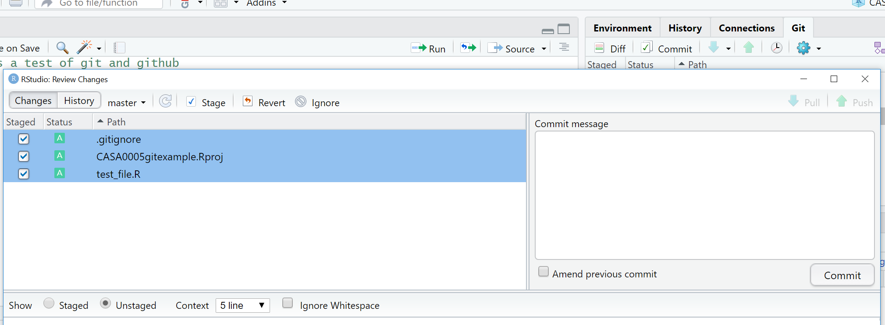

# Git, GitHub and RMarkdown


## Learning outcomes

* 
* 
* 
* 

## Introduction 

Technically this practical doesn't hold much on GIS methods, but...you will learn how to produce work that is open, reproducible, shareable and portable using RStudio, RMarkdown, Git and Github. As more and more researchers and organisations publish assocaited code with their manusripts or documents it's very imporant to become adept at using these tools.

You will be able to use the information contained in this guide to prepare the submission for Part 1 of the assessment for this course. The tools you will use are:

* RStudio is a graphical user interface (that you should already be familiar with) - it contains a number of features which make it excellent for authoring reproducible and open geographic data science work.

* RMarkdown is a version of the Markdown markup language which enables plain text to be formatted to contain links to data, code to run, text to explain what you a producing and metadata to tell your software what kinds of outputs to generate from your markdown code. For more information on RMarkdown, visit here.

* Git is a software version control system which allows you to keep track of the code you produce and the changes that you or others make to it.

* GitHub is an online repository that allows anyone to view the code you have produced (in whatever language you choose to program in) and use/scrutinise/contribute to/comment on it.

## Set up your GitHub

1. If you are working on your own computer, you will first need to install git - https://git-scm.com/ - if you are working on the UCL Remote Desktop, you won’t need to do this as it is already installed for you.

2. Go to http://github.com and install github (if working on your own computer). Create an account and create a new repository (call it anything you like - ‘gis_code’ or something similar), making sure it is public and you check the box that says ‘initialise new repository with a README’ - click ‘create repository’ at the bottom


3. Your new repository (‘repo’) will be created and this is where you will be able to store your code online. You will notice that a README.md markdown file has also been created. This can be edited to tell people what they are likely to find in this repository.

4. Now you have created your repo online, you need to ‘clone’ it so that there is an identical copy of it in a local folder on your computer.

There are a couple of ways of doing this, but the easy one is to use the GUI that comes packaged with your git installation.

5. The first thing you need to do is copy the Clone URL for your repo from the github website --- click the green button in your repo for ‘Clone or Download’ and copy the link:


6. Now in the windows start menu, go to Git > GUI

7. Select ‘Clone Existing Repository’ and paste the link from your GitHub account into the top box and the local directory that you want to create to store your repo in the bottom box (note, you will need to add a name for a new folder, once you have selected an existing directory, don't create a new folder in windows explorer you have to specify it in the file path).


8. After a few moments, you should now be able to view a copy of your GitHub repo on your local machine. This is where you will be able to store all of your code and some other files for your reproducible research.

## Using RStudio with Git

Now, as I’ve mentioned before, RStudio is totally bad-ass. Not only does it make R fun to use, but the lovely people who created it also built in support for things like git!

For a full and excellent tutorial on using Git with R Studio, watch this webinar: https://www.rstudio.com/resources/webinars/rstudio-essentials-webinar-series-managing-part-2/

If you don’t want to watch the vid, I’ll do a quick summary below. So, to use git, first you need to enable it in RStudio:

At the time of writing, because of the way that RStudio has been installed on the UCL Remote Desktop, git integration does not work. As such, if you are working on the remote desktop, DO NOT follow instructions 9 to 19 below, jump straight to instruction 20. If you are working on your own computer then fine, carry on.

9. Open RStudio. In RStudio Tools > Global Options, under ‘Git/SVN’ check the box to allow version control and locate the folder on your computer where the git.exe file is located. Allow Version Control for new Projects and navigate to where the git.exe file is on your computer. Click OK.

10. Now in RStudio, you should create a new project in an existing directory - File > New Project > Existing directory - choose your new git repository as your new project folder. You should not see a git tab in the environment window of RStudio (top right).

**Note** You could also link your Git directly from RStudio following: File > New Project > Version control > Git. But carry on using these insturctions for now. 

11. Open a new R Notebook in RStudio: File > New File R Notebook

12. Type some stuff (anything so that’s it’s not a blank empty file) at the top of the file and save it.

You should see the files appear under the Git tab


13. As well as saving, which saves a copy to our local directory, we will also ‘commit’ or create a save point for our work on git. To do this, you should click the ‘Git’ icon and up will pop a menu like the one below:


You can also click the Git tab that will have appeared in the top-right window of RStudio. Up will then pop another window that looks a little like the one below:



14. Stage the changes, add a commit message so you can monitor the changes you make, then click commit

15. Make some more changes to your file and save it. Click comitt again then in the review changes box you will be able to see what has changed within your file. Add a comitt message and click commit:


## Using Git outside RStudio

Sometimes RStudio Git can be a bit temperamental. For example, when staging the files they can take some time to appear with the ticked box (I think this is because we are working from the Network). A way around this in RStudio is to click the commit button, select to stage all the files, wait a few seconds then close the review changes box and commit from the buttons in the Git tab in the environment quadrant. 

Alternatively if you would like to use Git but you’re working on the UCL Remote Desktop or you are experiening other problems with getting git working in RStudio, fear not, you can just use your raw Git installation.

17. In the Start Menu, open the git GUI. Start > Git > Git GUI. You should open the existing repository that you have just created.

18. Whenever you have made some changes to your files in your cloned repo, you can use git to review the changes and ‘Commit’ (save) them and then ‘Push’ them up to your master repository on GitHub.

19. To review and commit your changes, in the commit menu, simply:

a. scan for changes
b. stage them ready for committing
c. commit the changes
d. push the changes to your GitHub repo

## Push to Github

Now we can push our changes to github using the up arrow either in the RStudio git tab (envrionment quadrant), or from the review changes box (opens when you click commit).

16. To do this, first make sure you have committed any changes to your local cloned repo and then click the ‘Push’ button to whizz your code up to your master GitHub repo --- you will probably be prompted to enter your github username and password to enable this…

But....if the push button is greyed out go to the section [Greyed out push button]


## Pull from GitHub

Pull will take any changes to the global repo and bring them into your local repo. Go to your example GitHub repo (online) and click on your test file > edit this file.

Add a line of code or a comment, preview the changes then commit directly to the master branch.


Now in RStudio click the down arrow (Pull) request. Your file should update in RStudio. 

If you were to update your file on GitHub and your local one in RStudio seperately you would receive an error message in RStudio when you attempted to commit. 

### Troubleshooting

#### Were you challenged for your password?

As of January 2019 it is possible that Git will use a credential helper provided by the operating system. So you should be asked for your GitHub username and password only once. As I am already logged into mine and I started using GitHub a while ago i'm not exactly sure when you will be asked for you details.  

You can however set your usename and email manually using the git prompt.

Go Tools > Shell and enter: 


```r
git config --global user.name 'yourGitHubUsername'
git config --global user.email 'name@provider.com'
```
These only need to be set once.

#### Greyed out push button

Is your push button greyed out? Mine was... Fear not....

First, let's check your local repostiority (Git) is connected to a remote one (GitHub). 

Open the Shell again (Tools > Shell) and enter:


```r
git remote -v
## output

origin  https://github.com/andrewmaclachlan/example.git (fetch)
origin  https://github.com/andrewmaclachlan/example.git (push)
```

The fetch and push should be your repository on GitHub. If you need to set the remote repo use:


```r
git remote add origin https://github.com/andrewmaclachlanc/myrepo.git
```

**Replace my name and myrepo with your account and repo**

Was it setup correctly ? Yes...

Then check the current branch in RStudio (and Git) is tracking a branch on the remote repo --- mine wasn't.


```r
git branch -vv

## output
master 3abe929 [origin/master] test3
```

Origin/master shows that the local master is tracking the origin/master on the remote repo. If you can't see origin/master then set it using:


```r
git push --set-upstream origin master
```

For more trouble shooting on Git and GitHub have a look at the book Happy Git and GitHub for the useR: https://happygitwithr.com/rstudio-git-github.html

## Fork a repository 

A *Fork* in github is a copy of someone elses repository. You could use it as a base starting point for your project or to make a fix and then submit a pull request to the original owner who would then *pull* your changes to their repository. 

You can fork a github example repository from: https://github.com/octocat/Spoon-Knife 

Once you fork it, you should see it in your repositories 

## Branches

Each repository you make in git has a default branch but you can create new branches to isolate development of specific areas of work without affecting other branches --- like a test envrionment. 

Go to the test repository you just forked on github. Click the branch drop down and type in the name for a new branch:


Now click on the README.md file > edit this file

Add some changes, preview them and complete the commit changes box at the bottom of the screen.


Here, we're going to commit directly to the new branch. We could have made this changes to the master branch and then made a new branch for them at this stage. Commit the changes.

Go to the home page of our example branch (click the branch down arrow and select your example branch). You'll see that our example branch is now 1 commit ahead of the master. 

Now let's create a *pull* reqest to the master branch. It you had modified someone elses code, then you would send a reqest to them to pull in the changes. Here we are doing a pull request for ourselves --- from our example branch to our master.

Click New pull request.

At the top you will see the branches that are being compared --- the base defaults to githubs example repository, change it to yours.


Now scroll down and you will see the comaparison of between the two branches. Click create pull request.  

Select squash and merge > confirm squash and merge. This means that all our commits on the exmaple branch and squashed into one, as we only have one it doesn't matter but could be useful in future. 

Got back to your master branch repositry and you should see the changes from the example branch have been merged.

## Health warning 

To avoid merge conflicts be careful with your commits, pushes and pulls. Think about what you are doing each time. GitHub help pages are quite comprehensive..https://help.github.com/en/articles/resolving-a-merge-conflict-on-github

## RMarkdown

OK, so now you have set everything up so that you can become a reproducable research ninja! All that remains is to do some reproducable research!

For the definitive guide on R Markdown, please read [R Markdown: The Definitive Guide](https://bookdown.org/yihui/rmarkdown/) --- obviously! It will tell you everything you need to know, far beyond what I am telling you here.

There is also an excellent guide on the R Studio website -https://rmarkdown.rstudio.com/lesson-1.html

And a quick cheatsheet here: https://github.com/rstudio/cheatsheets/raw/master/rmarkdown-2.0.pdf

And an older one here: http://www.rstudio.com/wp-content/uploads/2016/03/rmarkdown-cheatsheet-2.0.pdf

One of the awesome things about R Markdown is it can be converted into a range of different formats - html for webpages, word documents, PDFs, blogs, books - virtually everything!

Now, earlier on in this exercise, I got you to open a new R Notebook or R Markdown file. They are both R Markdown Documents, but the Notebook allows chunks of code to be run independently.

....Add Rmarkdown, making a website then bookdown as advanced section. 


